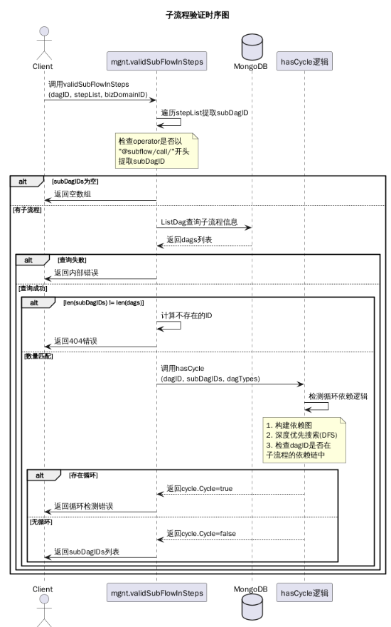

# 792990 【Dataflow】数据流支持子流程调用 —— 实现设计

> 来源：DIP-289770454-190126-1530-6728.pdf（保持原目录结构整理）

---

## 一、需求分析

### 1.1 需求背景

随着业务不断发展，系统中逐步沉淀了大量业务流程，不同流程之间存在较多相似或重复的审批逻辑。当前流程设计方式以“单流程独立配置”为主，缺乏统一抽象和复用机制，导致流程配置冗余、维护成本持续上升。

复杂业务场景下流程定义包含大量判断和审批节点，流程结构高度耦合，整体可读性和可维护性较差。流程一旦发生变更，需要逐个修改相关流程，调整成本高、风险大。

在流程数量持续增长、业务规则频繁变化的背景下，现有流程体系在复用性、扩展性和维护效率方面逐渐成为瓶颈。

### 1.2 用户期望

1. 降低流程冗余，提升配置效率
2. 降低流程耦合度，提升可读性和可维护性
3. 提升流程复用能力
4. 提升流程变更可控性与稳定性
5. 支撑业务快速迭代与长期演进

---

## 二、模块（服务）设计

设计方法使用 ​**C4 Model 自顶向下设计思想**​。

### 2.1 集成架构设计（Context）

表达与外部系统的集成关系、集成方式，基本元素为系统。

### 2.2 服务架构设计（Container）

表达本系统内微服务之间的依赖关系、调用关系，对应 DDD 建模中上下文。

### 2.3 组件设计（Component）

表达服务内部有哪些组件组成、组件职责和组件之间的交互关系。

### 2.4 代码和类设计（Code）

表达组件图内部代码级别的元素和关系，对应 DDD 中的领域模型。

#### 2.4.1 节点设计

##### 1）子流程调用节点

子流程调用节点签名定义：

* `@subflow/call/workflow` (子流程调用工作流)
* `@subflow/call/dataflow` (子流程调用数据流)

`version_id` 为子流程版本，子流程执行过程中根据版本 id 实现数据隔离。

示例：

```json
{
  "id": "1",
  "operator": "@subflow/call/workflow",
  "parameters": {
    "dag_id": "601184015138967572",
    "version_id": "601184015138967573",
    "data": {
      "dZzmCAipXuUUbnMO": "aa-bb"
    }
  }
}
```

**输入**

| 参数        | 类型   | 支持变量 | 是否可选 | 描述               |
| ------------- | -------- | ---------- | ---------- | -------------------- |
| dag_id | string | Y        | Y        | 子流程id |
| version_id | string | N        | N        | 子流程当前引用版本 |
| data        | object | Y        | Y        | 子流程输入数据     |

* 表单触发类型需透传表单节点参数
* 手动触发类型不需要请求参数

**输出**

* 循环节点：子流程输出直接引用循环节点输出列表
* 分支节点：最后节点不输出结果
* 功能节点：引用节点输出结果

---

### 2.5、关键流程设计（Sequence）

#### 2.5.1 创建或更新流程

流程与流程之间存在引用或被引用关系，在创建或更新流程时，只能向下校验引用关系，向上被引用关系无法检测，因此在创建或更新流程时只做环性引用检测

**核心流程说明：**

* 入口：客户端调用创建或更新接口
* 提取阶段：从step列表中提取所有子流程ID
* 验证阶段：
  * 如果没有子流程，直接返回
  * 如果有子流程，查询MongoDB验证存在性
  * 检查循环依赖
* 结果返回：
  * 成功：返回子流程ID列表
  * 失败：返回相应的错误信息



---

#### 2.5.2 列举子流程

当前系统包含两个主要流程列表接口：/v1/dags 与 /v2/dags，以及用于获取被分配流程的 /shared-dags 接口。

在功能划分上：

* 工作流界面：调用 /v1/dags 与 /shared-dags，获取当前用户相关流程（包括创建和被分配的流程）
* 数据流界面：调用 /v2/dags，仅获取当前用户创建的流程

现有问题：子流程调用节点需区分“工作流子流程”与“数据流子流程”。其中“工作流子流程”需要聚合 /v1/dags 和 /shared-dags 的结果，而当前接口无法满足这一需求。

为解决该问题，对接口进行以下升级：

扩展 **/v1/dags** 接口功能

**1、新增 scope 参数**

当前支持值：all（返回用户创建 + 被分配的所有流程）

原工作流界面可改为调用 /v1/dags?scope=all，替代原有双接口调用

**2、统一流程筛选机制**

在 **/v1/dags** 和**​ ​/v2/dags** 中均新增 trigger\_types 参数

支持按触发器类型筛选：manually（手动触发）和 form（表单触发）

支持多选，以 ”,“ 连接格式传入

上述调整确保：

* 工作流子流程能通过单一接口获取完整流程列表
* 各接口保持一致的筛选能力
* 向后兼容现有调用方式

---

#### 2.5.3 子流程回调

在流程编排场景中，子流程执行完成后，需要将执行结果回调至主流程，以驱动主流程继续执行后续节点。

当前子流程仅支持通过手动触发或表单触发方式启动，对应接口如下：

* /v1/run-instance/:dagId
* /v1/run-instance-form/:dagId

为支持子流程执行完成后的回调能力，并确保流程执行过程的稳定性与一致性，对现有接口进行扩展升级，具体设计如下。

1、接口参数扩展

* 新增 Query 参数：version\_id
  用于明确子流程触发时所使用的流程版本。在流程执行过程中，即使流程定义发生更新，执行实例仍基于触发时指定的版本运行，从而保证流程执行的一致性与可追溯性。
* 新增 Header 参数
  
  * X-Parent-Execution-ID：用于标识当前子流程所属的父级流程执行实例 ID。考虑到子流程之间可能存在多层嵌套调用关系，该参数用于构建完整的调用链路。同时，为防止无限递归调用影响系统稳定性，对子流程调用深度进行限制，当前最大调用深度为 10 层。
  * X-Callback-URL：用于指定子流程执行完成后的回调地址。子流程结束后，将执行结果通过该地址回调至主流程服务，以触发主流程继续执行后续节点。

2、回调数据结构设计

子流程回调采用 HTTP 请求方式，使用 POST 方法向 X-Callback-URL 指定的地址发送回调数据，数据格式为 JSON，

**注：工作流引用数据流或数据流引用工作流时，引用的子数据流不输出结果**

示例如下：
子流程执行成功

```json
{ 
    "creator": "a", 
    "modify\_time": "2025-02-18T11:18:54+08:00", 
    "editor\_id": "4fa5fafe-e751-11ef-b014-dac047ec7bab", 
    "name": "新建DOCX文档.docx", "new\_id": "", 
    "new\_path": "", 
    "new\_item\_id": "", 
    "editor": "a", 
    "id": "gns://CF790F7E7313479F8316AEBFEB500B58/887634A1DC7E4676AE8EAADAFA031842", 
    "size": "12233", 
    "item\_id": "887634A1DC7E4676AE8EAADAFA031842",
    "accessor": "{\\"id\\":\\"4fa5fafe-e751-11ef-b014-dac047ec7bab\\",\\"name\\":\\"a\\",\\"type\\":\\"user\\"}", 
    "rev": "45CD112903C44718934DFFD31F27478B", 
    "path": "a/新建DOCX文档.docx", 
    "creator\_id": "4fa5fafe-e751-11ef-b014-dac047ec7bab", 
    "create\_time": "2025-02-18T11:18:54+08:00", 
    "csflevel": 5 
}
```

子流程执行失败

```json
{ 
    "code": "Public.InternalServerError", 
    "description": "内部错误", 
    "solution": "请稍后重试或联系管理员", 
    "detail":"body : {\\"cause\\":\\"存在同类型的同名文件(gns:\\/\\/CF790F7E7313479F8316AEBFEB500B58\\/15DD600975884C80A64DE5B6C4083EE5,新建DOCX文档.docx)（错误提供者：EVFS，错误值：16777229，错误位置：ncEVFSCommandHandler.cpp:6315）\\",\\"code\\":403002039,\\"message\\":\\"存在同类型的同名文件名。\\"} , status : 403" 
}
```


---

## 三、接口设计

---

**接口变更汇总**

**1、/api/automation/v1/dags 接口变更**

新增 Query 参数

| 参数名 | 类型 | 可选值 / 示例 | 说明 |
|------|------|---------------|------| 
| scope | string | `all` | 返回范围：用户创建 + 被分配的所有流程 | 
| trigger_types | string | `manually` / `form` / `manually,form` | 按触发器类型筛选流程，支持多选 |

**2、/api/automation/v2/dags 接口变更**
新增 Query 参数 

| 参数名 | 类型 | 可选值 / 示例 | 说明 | 
|------|------|---------------|------| 
| trigger_types | string | `manually` / `form` / `manually,form` | 按触发器类型筛选流程，支持多选 |

**3、子流程触发接口变更**
涉及接口

- `/api/automation/v1/run-instance/:dagId`
- `/api/automation/v1/run-instance-form/:dagId`

新增 Query 参数

| 参数名 | 类型 | 示例 | 说明 |
|------|------|------|------| 
| version_id | string | `554195905797025336` | 指定子流程执行所使用的流程版本 |

新增 Header 参数

| Header 名称 | 示例 | 说明 |
|------------|------|------| 
| X-Parent-Execution-ID | `554195905797025337` | 父级流程执行实例 ID，用于构建调用链路 |
| X-Callback-URL | `https://workflow.xxx.com/callback/subflow` | 子流程执行完成后的回调地址 |
