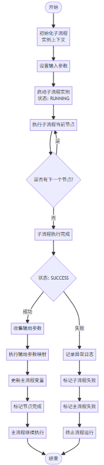

# 792990 【Dataflow】数据流支持子流程调用 —— 逻辑设计

---

## 一、需求分析

### 1.1 需求背景

#### 需求信息

| 字段 | 内容 |
|---|---|
| 需求号 | 792990 |
| 类型 | Feature |
| 标题 | 【Dataflow】支持子流程调用 |
| 状态 | In Realizing |
| 负责人 | 陈思宇（Siyu） |
| 需求来源 | 产品规划 / 产品反馈 |

#### 需求场景

随着业务不断发展，系统中逐步沉淀了大量业务流程，不同流程之间存在较多相似或重复的审批逻辑。当前流程设计方式以**单流程独立配置**为主，缺乏统一抽象和复用机制，导致：

- 流程配置冗余
- 维护成本持续上升
- 流程结构高度耦合
- 可读性、可维护性差

在流程数量持续增长、业务规则频繁变化的背景下，现有流程体系在**复用性、扩展性和维护效率**方面逐渐成为业务发展的瓶颈，亟需系统性优化和升级。

#### 用户期望

本次需求目标包括：

1. **降低流程冗余，提升配置效率**
   
   - 通用逻辑抽象
   - 一次配置，多处复用
2. **降低流程耦合度，提升可读性和可维护性**
   
   - 拆分复杂流程为子流程
   - 提升结构清晰度
3. **提升流程复用能力**
   
   - 构建可复用流程组件或模板
4. **提升流程变更的可控性与稳定性**
   
   - 规则集中维护
   - 降低修改风险
5. **支撑业务快速迭代与长期演进**

---

### 1.2 用户故事

| 角色 | 痛点（Why） | 活动（What） | 价值（Value） |
|---|---|---|---|
| 流程编排者 | 通用流程逻辑重复配置，设计效率低 | 将通用审批逻辑抽象为子流程 | 提升设计效率，减少重复工作 |
| 流程编排者 | 流程结构复杂、难维护 | 主流程调用子流程 | 提高可读性和可维护性 |
| 流程编排者 | 扩展和调整成本高 | 流程模块化 | 提供更高灵活性 |

---

## 二、业务功能设计

### 2.1 概念与术语

| 中文 | 英文 | 定义 |
|---|---|---|
| 主流程 | Parent Process | 发起子流程调用的上级流程 |
| 子流程 | Sub Process | 被主流程调用的独立流程，可复用 |

---

### 2.2 业务用例

#### 用例名称

**配置子流程调用节点**

#### 用例说明

| 项目 | 描述 |
|---|---|
| 参与者 | 流程设计者 |
| 前置条件 | 已存在可调用子流程；用户有流程编辑权限 |
| 后置条件 | 子流程调用节点配置完成 |

---

### 2.3 业务功能定义

#### 子流程定义管理

##### 创建子流程

- 用户需具有新建权限
- 名称规则：
  - 不包含 `/ : * ? " < > |`
  - 长度 ≤ 128
- 规则：
  - 仅一个开始节点
  - 至少一个功能节点
  - 开始节点类型：手动 / 表单触发
  - 初始版本号：`v0.0.0`

##### 编辑子流程

- 子流程存在
- 用户具有编辑权限
- 其余规则同新建

---

#### 子流程版本管理

- 采用语义化版本号：`vX.Y.Z`
- 新版本号必须大于当前最大版本
- 主流程引用指定版本
- 已发布历史版本不可删除

---

#### 输入 / 输出参数定义

**输入参数规则：**

- 参数名不可重复
- 可配置是否必填
- 非必填参数可设置默认值
- 参数需填写描述

**输出参数规则：**

- 子流程成功执行后
- 输出最后一个节点执行结果

---

#### 嵌套调用控制

- 禁止循环调用（如 A → B → C → A），接口调用时检测
- 最大调用嵌套深度：**10 层**（实际流程运行时检测）

---

### 2.4 功能流程图

#### 2.4.1 流程创建整体流程

#### 2.4.2 子流程实例执行流程

