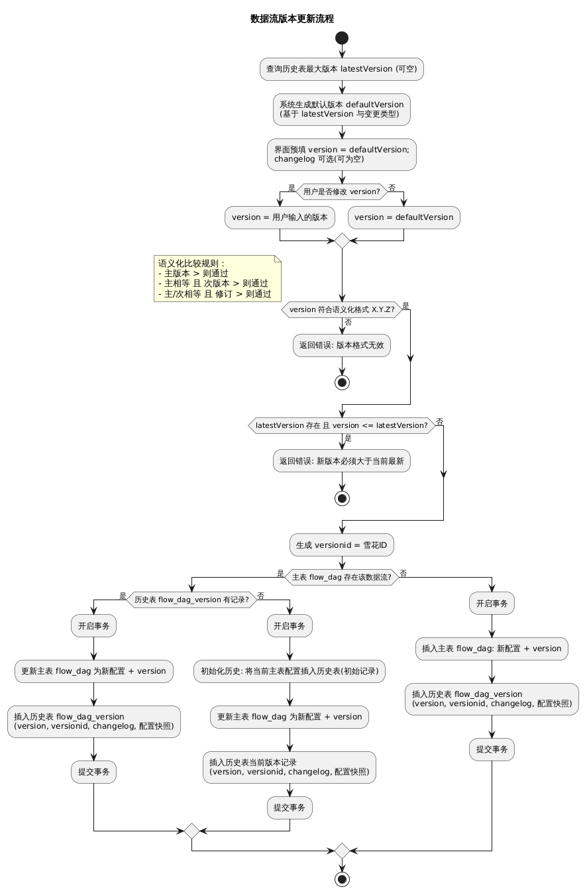

# DataFlow 版本管理 -- 实现设计

---

## 一、需求分析

### 1.1 需求背景

需求背景主要需求的来源、产生动机以及相关的业务场景，这有助于团队成员深入理解需求的本质。通过对需求背景的深入了解，可以更加准确地把握需求的核心，避免在后续的开发过程中出现偏差。

需求号

| ID | Work Item Type | Title  | State |
| --- | --- | --- |--- |
| #780167 |  Feature | 【Dataflow】流程支持版本管理 | Closed |
| #780168 | Feature  | 【Dataflow】流程执行日志存储优化 | Closed |

需求来源：产品规划

需求方：xxxx客户

需求场景：

1、引入新的权限机制后，数据管理员、AI管理员、应用管理员以及其他有权限的角色可以针对同一个流程进行编辑和修改，改动后无法朔源以及回滚

2、某些场景下实现流程级别的缓存能力，需要根据流程是否变动来决定是否加载缓存

3、动态生成流程执行日志时，如果更新流程配置，会导致已执行的流程实例无法生成对应执行日志

用户期望：

1、流程修改时会创建版本信息

2、可以将流程回滚到某个历史版本

3、历史版本的流程执行详情能够被查询

---

## 二、模块(服务)设计

以逻辑设计产出的用户故事和业务模型等为指导进行技术方案设计，目标是满足业务目标，包括功能和非功能以及部署相关的要求。

设计方法使用C4模型的设计思想：自顶向下设计。
https://c4model.com/

---

### 2.1 集成架构设计(Context)

表达和外部系统的集成关系、集成方式，基本元素为系统

---

### 2.2 服务架构设计(Container)

服务整体为流程配置提供完整的版本控制能力，确保业务流程变更的可追溯性和可恢复性。

系统采用语义化版本规范（Semantic Versioning），通过"主版本号.次版本号.修订号"的三段式版本号体系，清晰标识每次流程变更的重要程度。每次保存流程时自动生成新版本，系统智能推荐递增的版本号（默认按修订号递增）。

同时强制要求新版本必须大于历史版本，确保版本演进的单向性和连续性。

---

### 2.3 组件设计(Component)

表达服务内部有哪些组件组成、组件职责和组件之间的交互关系， ”组件“是个泛化的概念，可以 package 级别，也可以是类级别，但在逻辑是都表达组件的概念。

---

### 2.4 代码和类设计（Code）

表达组件图内部代码级别的元素和关系，对应 DDD 中的领域模型，如果比较关注代码实现层面的设计，可以用 UML 类图表达，如果比较关注底层数据模型，也可以用 E-R 表达，没有严格的限制。

---

### 2.5 关键流程设计 （Sequence）

表达技术方案中的关键流程，推荐使用时序图，也可以用流程图。

---

#### 2.5.1 创建版本

更新数据流时，用户指定当前更新的版本号或使用系统生成的最新版本号和变更信息，整体逻辑：

版本号需符合语义化版本规范，格式：主版本号.次版本号.修订版本号，具体规则可参考：[语义化版本](https://semver.org/lang/zh-CN/)

版本号仅支持数字如下所示：

| 当前已存在最新版本号 | 系统生成最新版本号 |
| ---------------------- | -------------------- |
| v0.0.0               | v0.0.1             |
| v0.1.0               | v0.1.1             |
| v1.0.0               | v1.0.1             |

新版本必须要大于当前最新版本号，**比较规则：**

* 主版本号：待更新版本大于当前已存在最新版本，则后续的次版本号和修订版本号无需比较
* 次版本号：如果主版本号相等，则次版本号大于已存在最新此版本号，则修订版本号无需比较
* 修订版本号：如果主版本号和次版本号都相等，则修订版本必须大于当前最新版本号

接口新增字段：

* version：语义化版本
* versionid：版本号唯一标识，雪花id
* changelog：版本变更说明

数据库新增：

* version：语义化版本
* version——id：版本号id
* modify——by：流程修改者id （原userid字段为流程创建者，在更新流程时未更新此字段，因此新增modify——by字段标识当前流程是由谁变更的）

历史版本表数据应该包含最新使用中的数据流信息（基于双表结构的版本管理）：

* 主表（flow——dag）：存储当前正在使用的最新流程配置
* 历史版本表（flow——dag——version）：存储所有历史版本记录

对于已存在数据流版本生成规则：

* 先判断当前历史记录表中是否存在
* 如果已存在历史版本信息，则更新主表同时插入历史版本表
* 如果不存在历史版本信息，则表示历史数据还未初始化，构建初始化历史版本信息，然后更新主表同时插入初始历史版本信息和当前历史版本历史信息

对于新创建的数据流版本生成规则：

* 直接插入主表同时插入历史版本表

---

#### 2.5.2 列举版本

支持获取最近50条生成的历史版本列表，版本列表包含以下信息：

- 版本id
- 版本号
- 修改说明
- 创建时间
- 创建人

---

#### 2.5.3 查看历史版本详情

对于任一历史版本可以查看其详细信息。包括：

- 版本id
- 版本号
- 修改说明
- 创建时间
- 创建人
- 流程信息

如果当前查看的历史版本不存在，页面提示版本不存在

---

#### 2.5.4 回滚版本

回滚版本时，需要指定新的版本号以及版本修改说明

新版本号：依然可以选择手动输入或使用系统推荐版本号

修改说明：若修改说明为空，则添加默认修改说明："版本xxx 退回 版本xxx"

---

#### 2.5.5 历史数据兼容性问题

在数据流系统运行过程中，当数据流配置发生更新并生成新版本时，流程执行引擎上可能仍存在大量基于旧版本数据流创建的流程实例等待调度执行。为了确保系统的向后兼容性和流程实例的正确执行，系统采用以下两种情况的处理策略：

**情况**​**​1：​**数据流存在更新且有大量流程实例待调度

* 当检测到当前数据流存在更新时，系统首先判断是否存在历史版本数据流配置
* 如果存在历史版本，系统将根据历史版本信息获取对应的历史数据流配置
* 使用历史配置信息来执行基于旧版本创建的流程实例，确保流程逻辑的一致性

**​情况2：​**数据流无更新但存在可调度的流程实例

* 当当前数据流不存在更新时，系统仍需要处理待调度的流程实例
* 为了保持与情况1的处理逻辑一致，系统首先检查是否存在历史版本
* 如果不存在历史版本，则按照原有的执行逻辑处理流程实例

---

#### 2.5.6 获取运行详情

当前数据流接入数据视图作为数据源触发，生成的流程实例数量极多，mongodb数据库存储压力激增，考虑当前系统执行成功的频率占多数，因此在流程执行成功后，主动删除该流程的task任务执行记录

所有的task执行记录都进行动态生成

---

## 三、接口设计

新增接口：

| 接口说明         | 请求方式 | 路由                                           | 说明                                                                  |
| ------------------ | ---------- | ------------------------------------------------ | ----------------------------------------------------------------------- |
| 获取历史版本列表 | GET      | /v1/dags/{dagId}/versions                      |                                                                       |
| 回退历史版本     | POST     | /v1/dags/{dagId}/versions/{versionId}/rollback |                                                                       |
| 获取下一个版本号 | GET      | /v1/dags/{dagId}/versions/next                 |                                                                       |
| 创建数据流       | POST     | /v1/data-flow/flow                             | 已有接口，新增参数version：语义化版本change_log：变更说明（考虑删除） |
| 更新数据流       | PUT      | /v1/data-flow/flow/:id                         | 已有接口，新增参数version：语义化版本change_log：变更说明             |

---

## 四、数据库设计

mongoDB数据库变更

1、新增flow_dag_version表

功能：多版本管理数据流历史记录

| 字段名      | 类型   | 说明           |
| ------------- | -------- | ---------------- |
| _id        | string | 主键id         |
| createdAt   | int64  | 创建时间       |
| updatedAt   | int64  | 更新时间       |
| dagId       | string | 数据流id       |
| version     | string | 语义化版本号   |
| version_id | int64  | 版本号id       |
| change_log | string | 变更说明       |
| config      | string | 数据流配置信息 |

2、flow_dag表新增如下字段：

| 字段名      | 类型   | 说明         |
| ------------- | -------- | -------------- |
| version     | string | 语义化版本   |
| version_id | string | 版本号id     |
| modify_by  | string | 流程更新者id |

---
