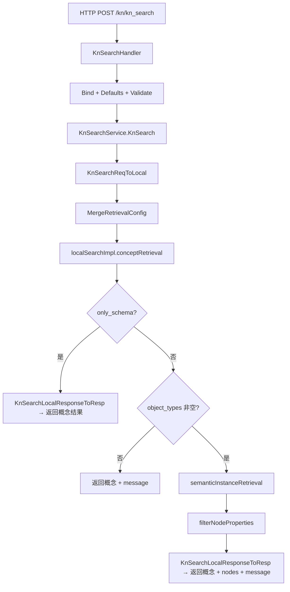

# KnSearch 模块实现设计文档

## 文档信息

| 项目 | 内容 |
|------|------|
| **功能名称** | KnSearch（知识网络检索） |
| **关联文档** | [KnSearch模块逻辑设计.md](./KnSearch模块逻辑设计.md) |
| **文档版本** | v1.0 |
| **状态** | 已实现 |

---

## 1. 概述

本文档描述 KnSearch 在 agent-retrieval 内的技术实现方案，包括代码结构、分层架构、核心流程、配置与依赖服务。KnSearch 采用**本地实现**，不依赖 data-retrieval 的 kn_search。

### 1.1 设计目标

1. **独立实现**：在 agent-retrieval 内用 Go 实现完整检索流水线，不依赖 data-retrieval 的 kn_search。
2. **分层清晰**：HTTP Handler → 业务逻辑（概念召回 + 语义实例召回）→ 驱动适配器（Ontology Manager / Ontology Query / MF Model API）。
3. **可配置**：召回参数通过 retrieval_config 与默认值合并，支持按场景调优。

### 1.2 设计原则

- **单一职责**：概念召回、语义实例召回、配置合并、属性过滤分文件/函数实现。
- **复用驱动**：复用现有 OntologyManagerAccess、DrivenOntologyQuery、MFModelAPIClient。
- **优雅降级**：Rerank 失败时回退到简单匹配排序；语义实例召回失败时保留概念结果并写 message。

---

## 2. 代码结构

### 2.1 文件清单

```
agent-retrieval/server/
├── interfaces/
│   └── kn_search_local.go       # 本地实现请求/响应/配置/服务接口
├── logics/
│   └── knsearch/
│       ├── index.go             # 服务入口与依赖注入（localSearchImpl、KnSearchService）
│       ├── config.go            # 配置合并与默认值
│       ├── convert.go           # KnSearchReq ↔ KnSearchLocalRequest 转换
│       ├── service.go           # 主流程编排（localSearchImpl.Search）
│       ├── concept_retrieval.go # 概念召回（粗召回、Rerank、对象选择、转换、样例数据）
│       ├── semantic_instance_retrieval.go  # 语义实例召回
│       └── semantic_searchable_fields.go   # 可语义检索字段筛选
└── driveradapters/
    └── knsearch/
        └── index.go             # HTTP Handler（KnSearchHandler）
```

### 2.2 分层架构图

```
┌─────────────────────────────────────────────────────────────────┐
│                     Driver Adapters (HTTP)                       │
│  ┌─────────────────────────────────────────────────────────────┐ │
│  │ driveradapters/knsearch/index.go                              │ │
│  │   - 绑定 Header (x-account-id, x-account-type)                │ │
│  │   - 绑定 JSON Body → KnSearchReq                              │ │
│  │   - defaults.Set + validator.Struct 校验                      │ │
│  │   - KnSearchService.KnSearch(ctx, req) → 响应                 │ │
│  └─────────────────────────────────────────────────────────────┘ │
├─────────────────────────────────────────────────────────────────┤
│                     Business Logic (logics/knsearch)             │
│  ┌─────────────────────────────────────────────────────────────┐ │
│  │ service.go        主流程：合并配置 → 概念召回 → 可选语义实例召回 │ │
│  │ config.go         默认配置与 MergeRetrievalConfig            │ │
│  │ concept_retrieval.go  概念召回全流程                          │ │
│  │ semantic_instance_retrieval.go  语义实例召回全流程            │ │
│  │ semantic_searchable_fields.go  可语义检索字段                  │ │
│  └─────────────────────────────────────────────────────────────┘ │
├─────────────────────────────────────────────────────────────────┤
│                     Driven Adapters                              │
│  ┌────────────────┐ ┌────────────────┐ ┌────────────────────┐  │
│  │ OntologyManager│ │ OntologyQuery  │ │ MFModelAPIClient   │  │
│  │ 知识网络详情   │ │ 实例检索       │ │ Rerank             │  │
│  │ 粗召回         │ │                │ │                    │  │
│  └────────────────┘ └────────────────┘ └────────────────────┘  │
├─────────────────────────────────────────────────────────────────┤
│                     Interfaces                                   │
│  ┌─────────────────────────────────────────────────────────────┐ │
│  │ interfaces/kn_search_local.go                                │ │
│  │   KnSearchLocalRequest/Response, KnSearchRetrievalConfig,    │ │
│  │   KnSearchConceptRetrievalConfig, KnSearchObjectType,        │ │
│  │   KnSearchRelationType, KnSearchActionType, KnSearchNode,    │ │
│  │   IKnSearchLocalService                                      │ │
│  └─────────────────────────────────────────────────────────────┘ │
└─────────────────────────────────────────────────────────────────┘
```

### 2.3 数据流图



---

## 3. 核心流程

### 3.1 主流程（service.go）

1. **合并配置**：`MergeRetrievalConfig(req.RetrievalConfig)`，得到概念召回、语义实例召回、属性过滤的完整配置。
2. **概念召回**：`conceptRetrieval(ctx, req, mergedConfig.ConceptRetrieval)` → KnSearchConceptResult（object_types, relation_types, action_types）。
3. **构建响应**：先填充 object_types、relation_types、action_types。
4. **仅概念模式**：若 `req.OnlySchema` 为 true，直接返回，不执行语义实例召回。
5. **语义实例召回**：若 `len(conceptResult.ObjectTypes) > 0`，调用 `semanticInstanceRetrieval(ctx, req, conceptResult.ObjectTypes, mergedConfig)`，将返回的 nodes 与 message 写入响应；失败时写 message，不覆盖已有概念结果。
6. **无概念提示**：若概念召回到的对象类型为空，在 message 中写「未召回到相关概念，无法进行实例检索」。

### 3.2 概念召回（concept_retrieval.go）

1. **获取知识网络详情**：`GetKnowledgeNetworkDetail(ctx, req.KnID)`。
2. **粗召回（可选）**：当 `enable_coarse_recall` 为 true 且关系类型数 ≥ `coarse_min_relation_count` 时，调用 `coarseRecall`：对对象类型、关系类型分别做 SearchObjectTypes / SearchRelationTypes（knn+match），再过滤 detail 中的 ObjectTypes、RelationTypes。
3. **关系类型排序**：`rankRelationTypes(ctx, query, objectTypes, relationTypes, topK, enableRerank)`：调用 MF Model API Rerank 对关系类型排序，取 Top-K；失败时回退到简单字符串匹配排序。
4. **对象类型选择**：`selectObjectTypesForConceptRetrieval`：根据关系类型反推对象类型并做数量/分数截断。
5. **转换为本地结构**：`convertObjectTypesToLocal`、`convertRelationTypesToLocal`、`convertActionTypesToLocal`（与 schema_brief 等配置一致）。
6. **样例数据（可选）**：当 `include_sample_data` 为 true 时，`fetchSampleData` 为各对象类型拉取样例。

### 3.3 语义实例召回（semantic_instance_retrieval.go）

1. **按对象类型遍历**：对概念召回得到的每个 KnSearchObjectType 调用 `retrieveInstancesForObjectType`。
2. **可语义检索字段**：`findSemanticSearchableFields(objType)`，无则跳过该对象类型。
3. **构建检索条件**：`buildSemanticSearchConditionStruct(req.Query, objType, config)`，构造 KNN/Match 等 sub_conditions，受 `max_semantic_sub_conditions` 等限制。
4. **实例检索**：调用 `QueryObjectInstances`（Ontology Query）获取候选实例，打分与排序（含 min_direct_relevance、exact_name_match_score 等）。
5. **全局分数过滤**：当 `enable_global_final_score_ratio_filter` 为 true 时，按 `maxScore * global_final_score_ratio` 过滤，并保证至少保留最高分的一条。
6. **属性过滤**：`filterNodeProperties(allNodes, propertyConfig)`，按 max_properties_per_instance、max_property_value_length、enable_property_filter 处理。

### 3.4 配置合并（config.go）

- **MergeRetrievalConfig**：以默认配置为 base，若 userConfig 非空则按字段合并：
  - ConceptRetrieval：top_k、skip_llm、return_union、include_sample_data、schema_brief、enable_coarse_recall、coarse_*、enable_property_brief、per_object_property_top_k、global_property_top_k。
  - SemanticInstanceRetrieval：initial_candidate_count、per_type_instance_limit、max_semantic_sub_conditions、semantic_field_*、min_direct_relevance、enable_global_final_score_ratio_filter、global_final_score_ratio、exact_name_match_score。
  - PropertyFilter：max_properties_per_instance、max_property_value_length、enable_property_filter。
- 默认值（与代码一致）：concept top_k=10、schema_brief=true、enable_coarse_recall=true、coarse_object_limit=2000、coarse_relation_limit=300、coarse_min_relation_count=5000；semantic initial_candidate_count=50、per_type_instance_limit=5、min_direct_relevance=0.3、global_final_score_ratio=0.25；property max_properties_per_instance=20、max_property_value_length=500。

---

## 4. 依赖服务

| 服务 | 用途 | 适配器/接口 |
|------|------|-------------|
| Ontology Manager | 获取知识网络详情、粗召回（SearchObjectTypes、SearchRelationTypes） | OntologyManagerAccess |
| Ontology Query | 实例检索（QueryObjectInstances，KNN/Match 条件） | DrivenOntologyQuery |
| MF Model API | 关系类型 Rerank | DrivenMFModelAPIClient（Rerank） |

---

## 5. 接口与类型（interfaces/kn_search_local.go）

- **KnSearchLocalRequest**：Header（AccountID、AccountType）；Body：Query、KnID、SessionID、AdditionalContext、RetrievalConfig、OnlySchema、EnableRerank。
- **KnSearchRetrievalConfig**：ConceptRetrieval、SemanticInstanceRetrieval、PropertyFilter 三个子配置。
- **KnSearchLocalResponse**：ObjectTypes、RelationTypes、ActionTypes、Nodes、Message。
- **KnSearchObjectType / KnSearchDataProperty / KnSearchLogicProperty / KnSearchRelationType / KnSearchActionType / KnSearchNode**：与 OpenAPI 及实际返回结构一致。

**说明**：KnSearchHandler 使用 KnSearchReq/KnSearchResp（interfaces/drivenadapters.go），内部通过 convert.go 的 `KnSearchReqToLocal`、`KnSearchLocalResponseToResp` 与本地实现结构互转。

---

## 6. 路由注册

- 在 `server/driveradapters/rest_private_handler.go` 中注册：`engine.POST("/kn/kn_search", r.KnSearchHandler.KnSearch)`。
- 引擎挂载在 `/api/agent-retrieval/in/v1` 下，故完整路径为：`POST /api/agent-retrieval/in/v1/kn/kn_search`。

---

## 7. 参考

- [KnSearch模块逻辑设计.md](./KnSearch模块逻辑设计.md)
- [kn_search.openapi.yaml](./kn_search.openapi.yaml)
