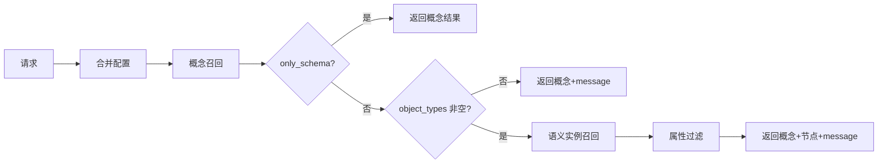
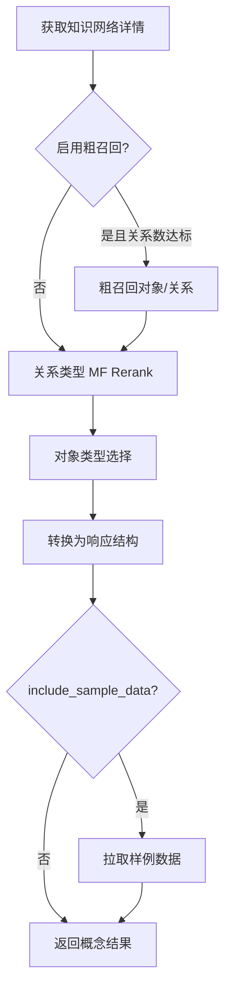
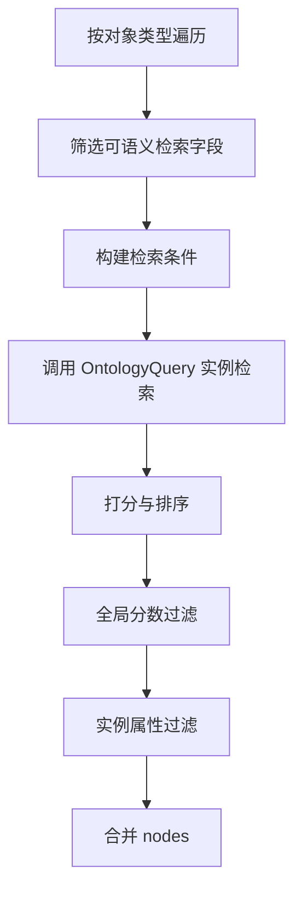

# KnSearch 模块逻辑设计文档

## 文档信息

| 项目 | 内容 |
|------|------|
| **功能名称** | KnSearch（知识网络检索） |
| **接口路径** | `POST /api/agent-retrieval/in/v1/kn/kn_search` |
| **文档版本** | v1.0 |
| **状态** | 已实现 |

---

## 1. 背景与目标

### 1.1 功能定位

KnSearch 为 Agent/大模型提供基于知识网络的上下文检索能力。接口在 agent-retrieval 内独立实现（本地实现），根据用户 query 与知识网络 ID，召回与查询相关的**概念**（对象类型、关系类型、操作类型）以及可选的**语义实例**（节点数据），供下游做意图理解、RAG 等使用。

### 1.2 目标

- 对外提供 `POST /api/agent-retrieval/in/v1/kn/kn_search`，支持**概念召回**与**语义实例召回**。
- 概念召回：返回与 query 相关的 object_types、relation_types、action_types，支持粗召回、语义排序（MF Rerank）、Schema 精简与属性裁剪、样例数据等。
- 语义实例召回：在概念召回得到的对象类型上，按可语义检索字段做 KNN/Match 检索，返回 nodes，并支持分数过滤与实例属性过滤。
- 通过 retrieval_config 与默认配置合并，支持按场景调优。
- **不调用 KnowledgeRerank**：关系类型排序直接使用 MF Model API Rerank。

---

## 2. 功能需求

### 2.1 功能概览

| 功能 | 描述 | 优先级 |
|------|------|--------|
| 概念召回 | 根据 query 召回相关的 object_types、relation_types、action_types | P0 |
| 粗召回 | 大规模知识网络下先做对象/关系粗召回，再精排 | P0 |
| 关系类型 Rerank | 使用 MF Model API 对关系类型做语义排序，取 Top-K | P0 |
| 对象类型选择 | 根据关系类型反推对象类型，并做数量与分数截断 | P0 |
| Schema 精简与属性裁剪 | schema_brief、enable_property_brief、per_object/global property Top-K | P0 |
| 样例数据 | include_sample_data 时拉取对象类型样例 | P1 |
| 语义实例召回 | 在概念召回得到的对象类型上做 KNN/Match 实例检索 | P0 |
| 全局分数过滤 | 按 max_final_score * global_final_score_ratio 过滤实例 | P0 |
| 实例属性过滤 | 每实例最大属性数、属性值最大长度 | P0 |
| 仅概念模式 | only_schema=true 时只返回概念，不召回实例 | P0 |

### 2.2 请求参数

- **Header**（可选）
  - `x-account-id`: 账户 ID
  - `x-account-type`: 账户类型，枚举 `user` / `app` / `anonymous`
  - `Content-Type`: 建议 `application/json`

- **Body**
  - `query`（必填）：用户查询或关键词，多个关键词可用空格分隔。
  - `kn_id`（必填）：知识网络 ID（单个）。
  - `session_id`（可选）：会话 ID，当前实现仅透传。
  - `additional_context`（可选）：额外上下文，当前实现未使用。
  - `retrieval_config`（可选）：召回配置，不传则使用默认配置。
  - `only_schema`（可选，默认 `false`）：为 `true` 时只做概念召回，不进行语义实例召回。
  - `enable_rerank`（可选，默认 `true`）：是否对关系类型启用 Rerank。

### 2.3 召回配置（retrieval_config）

- **concept_retrieval**：概念召回
  - top_k、skip_llm、return_union、include_sample_data、schema_brief、enable_coarse_recall、coarse_*、enable_property_brief、per_object_property_top_k、global_property_top_k 等。

- **semantic_instance_retrieval**：语义实例召回
  - initial_candidate_count、per_type_instance_limit、max_semantic_sub_conditions、semantic_field_*、min_direct_relevance、enable_global_final_score_ratio_filter、global_final_score_ratio、exact_name_match_score 等。

- **property_filter**：实例属性过滤
  - max_properties_per_instance、max_property_value_length、enable_property_filter。

未传或部分未传时，与默认值合并（MergeRetrievalConfig）。

### 2.4 响应结构

- `object_types`：对象类型列表（概念召回）。
- `relation_types`：关系类型列表（概念召回）。
- `action_types`：操作类型列表（概念召回）。
- `nodes`：语义实例列表（非 only_schema 且概念召回到对象类型时可能返回）。
- `message`：提示信息（如未召回到概念或实例时的说明）。

### 2.5 业务规则

1. **配置合并**：请求中的 `retrieval_config` 与系统默认配置按字段合并，未传字段使用默认值。
2. **仅概念模式**：`only_schema=true` 时，执行概念召回后直接返回，不执行语义实例召回。
3. **无概念时的实例**：若概念召回得到的 object_types 为空，则不进行语义实例召回，并在 `message` 中返回「未召回到相关概念，无法进行实例检索」。
4. **语义实例失败**：语义实例召回失败时，概念结果照常返回，并在 `message` 中说明失败原因，nodes 可为空。

---

## 3. 核心流程与逻辑说明

### 3.1 主流程

---

### 3.2 概念召回逻辑

概念召回的目标是：在指定知识网络下，从全量 Schema 中选出与 query 最相关的对象类型、关系类型，并带上操作类型，供后续实例检索或直接返回。

**步骤概览**：获取知识网络详情 → 可选粗召回 → 关系类型排序（MF Rerank 或简单匹配）并取 Top-K → 对象类型选择（按关系反推 + 数量/分数截断）→ 转换为响应结构（含 Schema 精简、属性裁剪）→ 可选拉取样例数据。

#### 3.2.1 获取知识网络详情

- 调用 Ontology Manager：根据 `kn_id` 获取该知识网络下的全量 ObjectTypes、RelationTypes、ActionTypes。
- 若失败则直接返回错误，不继续后续步骤。

#### 3.2.2 粗召回（可选）

- **触发条件**：`enable_coarse_recall=true` 且当前知识网络的关系类型数量 ≥ `coarse_min_relation_count`（默认 5000）。小规模网络不启用粗召回，直接用全量 Schema 进入排序。
- **做法**：
  - 对**对象类型**：调用 Ontology Manager 的 SearchObjectTypes，查询条件为 `knn(*, query)` 与 `match(*, query)` 的 OR 组合，按 `_score` 降序，限制条数为 `coarse_object_limit`（默认 2000），得到粗召回对象类型 ID 集合及分数。
  - 对**关系类型**：同样调用 SearchRelationTypes，条件与排序同上，限制条数为 `coarse_relation_limit`（默认 300），得到粗召回关系类型 ID 集合及分数。
  - **过滤**：在知识网络详情上做过滤。对象类型保留「在粗召回对象 ID 中」或「作为粗召回关系类型的 source/target 端点」的并集；关系类型保留在粗召回关系 ID 中的集合。粗召回失败或返回空时，不改变原详情，继续用全量 Schema 做后续步骤。

#### 3.2.3 关系类型排序逻辑（取 Top-K）

- **输入**：当前（可能经粗召回裁剪后的）ObjectTypes、RelationTypes，以及 `query`、`top_k`、`enable_rerank`。
- **若 enable_rerank=false**：不做 Rerank，仅按当前顺序截断前 `top_k` 条关系类型。
- **若 enable_rerank=true**：
  - 将每条关系类型格式化为一段文本：`源对象类型名称 + 关系类型名称（及 comment）+ 目标对象类型名称`，作为 Rerank 的 documents。
  - 调用 MF Model API 的 Rerank 接口：query 为用户 query，documents 为上述关系描述列表，得到每条关系类型与 query 的相关性分数。
  - 按 Rerank 分数**降序**排序，取前 `top_k` 条关系类型。
  - 若 Rerank 调用失败，则**回退**到简单匹配排序：对每条关系类型用 `calculateRelevanceScore(query, rel.Name, rel.Comment)` 打分（名称完全匹配 +1.0，名称包含 query +0.5，query 包含名称 +0.3，描述包含 query +0.2），再按该分数降序取前 `top_k` 条。

#### 3.2.4 对象类型选择逻辑

- **有排序后的关系类型时**：
  - 先按关系反推对象类型：收集所有关系类型的 `source_object_type_id`、`target_object_type_id`，得到「与这些关系相关的对象类型」集合 A。
  - 从知识网络的对象类型列表中筛出 ID 属于 A 的对象，记为 `filtered`。目标数量上限为 `max(len(relations)*2, top_k)`；若 `filtered` 已不少于该上限，直接返回 `filtered`。
  - 若不足：从**未**出现在 `filtered` 中的对象类型里，先选「粗召回或 Rerank 中有分数」的，按分数降序补齐，再补无分数的，直到达到数量上限。
- **无关系类型时**（如知识网络没有关系或粗召回后为空）：对所有对象类型按分数（粗召回带来的 Score）降序排序，无分数的排在后面，然后截断前 `top_k * 2` 条，作为选中的对象类型。

#### 3.2.5 转换为响应结构与属性裁剪、样例数据

- 将选中的对象类型、排序后的关系类型、以及知识网络下的操作类型，转换为接口定义的响应结构（KnSearchObjectType、KnSearchRelationType、KnSearchActionType）。
- **Schema 精简**（schema_brief=true）：对象类型只保留约定字段；属性可只保留 name/comment 等，具体与实现一致。
- **属性裁剪**（enable_property_brief=true）：对对象类型上的 data_properties/logic_properties 按与 query 的相关性（如名称/描述包含关系）做 per_object_property_top_k 与 global_property_top_k 裁剪。
- **样例数据**：若 `include_sample_data=true`，对每个返回的对象类型拉取一条样例数据写入 `sample_data`。

---

### 3.3 语义实例召回逻辑

在概念召回得到对象类型列表后，对**每个对象类型**在其实例上做语义检索，合并结果后再做全局分数过滤与实例属性过滤。

#### 3.3.1 可语义检索字段

- 仅当对象类型存在**可语义检索的数据属性**时，才对该对象类型做实例检索，否则跳过。
- **可语义检索**判定：属性类型为文本类（如 text、string、varchar、char），且其 `condition_operations` 中包含以下至少一种：`knn`、`match`、`equal`。
- 会区分：是否支持 KNN、是否支持 Match、是否支持 Equal，用于后续构造子条件。

#### 3.3.2 检索条件构建

- 对当前对象类型，从上一步得到的可语义检索字段列表中，构造 Ontology Query 的查询条件：
  - **子条件**（OR 组合，总数不超过 `max_semantic_sub_conditions`，默认 10）：
    - 对支持 KNN 的字段：添加 `knn(field, query)`，limit 为 `per_type_instance_limit`。
    - 对支持 Equal 的字段：添加 `field == query`。
    - 对支持 Match 的字段：添加 `match(field, query)`。
  - 顶层为这些子条件的 **OR**，表示「任一字段与 query 语义相关或匹配即可召回」。

#### 3.3.3 实例检索与单类型内排序、截断

- 调用 Ontology Query 的 QueryObjectInstances：传入 `kn_id`、对象类型 ID、上述条件、以及 `limit=initial_candidate_count`（默认 50），获取候选实例。
- 将每条实例转换为 KnSearchNode（含 object_type_id、object_type_name、instance_name、unique_identities、properties、以及若有的 _score）。
- **打分**（scoreNodes）：
  - 若实例已带 `_score`（来自向量检索），则保留不改。
  - 否则用名称匹配打分：`instance_name == query` 则设为 `exact_name_match_score`（默认 0.85）；否则 instance_name 包含 query 给 0.5，query 包含 instance_name 给 0.3。
- **排序**：按 Score 降序排序。
- **截断**：只保留前 `per_type_instance_limit`（默认 5）条。
- **直接相关性过滤**：丢弃 `Score < min_direct_relevance`（默认 0.3）的节点。

各对象类型的节点列表合并为 `allNodes`，并记录全局最大分数 `maxScore`。

#### 3.3.4 全局分数过滤

- **条件**：`enable_global_final_score_ratio_filter=true` 且 `maxScore > 0` 且 `allNodes` 非空。
- **阈值**：`threshold = maxScore * global_final_score_ratio`（默认 0.25）。
- **规则**：只保留 `Score >= threshold` 的节点；若过滤后为空，则**至少保留分数最高的 1 条**，避免全部被滤掉。

#### 3.3.5 实例属性过滤

- **条件**：`enable_property_filter=true`（默认 true）。
- **规则**：
  - 每个节点的 `properties` 键数不超过 `max_properties_per_instance`（默认 20），超过则按键名排序后只保留前 N 个。
  - 每个属性值为字符串时，长度不超过 `max_property_value_length`（默认 500），超过则截断并追加 "..."。

最终得到的 nodes 与 message（若无实例则写入「未检索到符合条件的实例数据」等）一并返回。

---

### 3.4 排序逻辑汇总

| 阶段 | 排序/截断方式 |
|------|----------------|
| 关系类型 | MF Rerank 分数降序（或回退为名称/描述与 query 的简单匹配分）→ 取 Top-K |
| 对象类型 | 先按「与关系类型相关」过滤；不足时按粗召回/Rerank 带来的分数降序补齐；无关系时按分数降序取 top_k*2 |
| 单对象类型内实例 | 按实例 Score 降序 → 取 per_type_instance_limit → 再按 min_direct_relevance 过滤 |
| 全局实例 | 按 maxScore * global_final_score_ratio 阈值过滤，至少保留最高分 1 条 |

---

## 4. 数据流图（概念与实例子流程）

### 4.1 概念召回子流程

### 4.2 语义实例召回子流程

---

## 5. 依赖与约束

- **Ontology Manager**：获取知识网络详情、粗召回（SearchObjectTypes、SearchRelationTypes）。
- **Ontology Query**：实例检索（QueryObjectInstances，KNN/Match 条件）。
- **MF Model API**：关系类型 Rerank（不通过 KnowledgeRerank 模块）。
- session_id、additional_context 仅作透传或预留，当前无多轮会话与 return_union 等逻辑。

---

## 6. 参考文档

- [KnSearch模块实现设计.md](./KnSearch模块实现设计.md)
- [kn_search.openapi.yaml](./kn_search.openapi.yaml)
