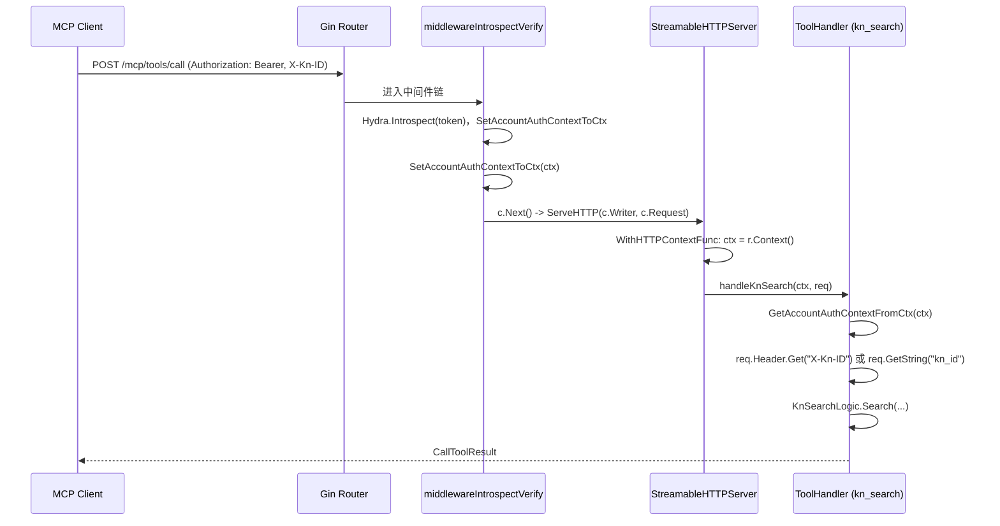

# feature-mcp-server: Streamable HTTP MCP Server - 实现设计文档

## 文档信息

| 项目 | 内容 |
|------|------|
| **需求编号** | feature-mcp-server |
| **关联需求文档** | [需求设计文档.md](./需求设计文档.md) |
| **文档版本** | v1.0 |
| **创建日期** | 2026-02-01 |

---

## 1. 概述

本文档描述 Agent Retrieval Streamable HTTP MCP Server 的技术实现方案，包括代码结构、Gin 集成、Context 透传、kn_id Header 获取和 ToolHandler 设计。

### 1.1 设计目标

1. **最小侵入**：在现有 Gin 应用中挂载 MCP Server，复用中间件与业务逻辑
2. **认证与上下文**：确保 ToolHandler 能获取 token 和 kn_id（通过 Header）
3. **可扩展**：便于后续增加更多 MCP 工具

### 1.2 设计原则

- **单一职责**：MCP 相关代码集中在 `mcp` 子包
- **复用**：KnSearch 逻辑复用现有 logics 层
- **配置驱动**：MCP 端点路径等可配置

---

## 2. 架构设计

### 2.1 分层架构图

```
┌─────────────────────────────────────────────────────────────────┐
│                     Driver Adapters (HTTP)                       │
│  ┌─────────────────────┐    ┌──────────────────────────────────┐ │
│  │ rest_public_handler │    │ mcp/ (NEW)                        │ │
│  │   - KnRetrieval      │    │   - StreamableHTTPServer 挂载    │ │
│  │   - KnSearch (新增)  │    │   - 路由: /mcp/*                  │ │
│  │   - MCP Server       │    │   - 中间件: IntrospectVerify      │ │
│  └─────────────────────┘    └──────────────────────────────────┘ │
├─────────────────────────────────────────────────────────────────┤
│                     Business Logic                               │
│  ┌─────────────────────────────────────────────────────────────┐ │
│  │ logics/knsearch/  (复用)                                     │ │
│  └─────────────────────────────────────────────────────────────┘ │
└─────────────────────────────────────────────────────────────────┘
```

**说明**：MCP Server 挂载在**公开接口**路由组（`/api/agent-retrieval/v1`）下，使用 `middlewareIntrospectVerify`（Bearer token 认证），以支持 Cursor、Claude Desktop 等外部 MCP 客户端。需将 KnSearchHandler 添加到 rest_public_handler。

### 2.2 请求流



### 2.3 kn_id 获取逻辑

```
┌─────────────────────────────────────────────────────────────┐
│ ToolHandler: handleKnSearch(ctx, req)                        │
├─────────────────────────────────────────────────────────────┤
│ 1. knID := req.Header.Get("X-Kn-ID")                        │
│ 2. if knID == "" { knID = req.GetString("kn_id", "") }      │
│ 3. if knID == "" { return error "kn_id is required..." }    │
│ 4. query := req.GetString("query", "")                      │
│ 5. if query == "" { return error "query is required" }       │
│ 6. 构造 KnSearchReq，调用 KnSearchService.KnSearch          │
└─────────────────────────────────────────────────────────────┘
```

---

## 3. 代码结构

### 3.1 新增文件

| 文件 | 职责 |
|------|------|
| `server/driveradapters/mcp/app.go` | 创建 MCPServer、StreamableHTTPServer，注册工具，返回 http.Handler |
| `server/driveradapters/mcp/tools.go` | kn_search ToolHandler 实现，含 kn_id Header 获取逻辑 |
| `server/driveradapters/mcp/config.go` | MCP 相关配置（端点路径等） |

### 3.2 修改文件

| 文件 | 变更说明 |
|------|----------|
| `server/driveradapters/rest_public_handler.go` | 添加 KnSearchHandler，注册 MCP 路由，挂载 StreamableHTTPServer |
| `go.mod` | 添加 mark3labs/mcp-go v0.43.2 依赖（若尚未引入） |

---

## 4. 核心实现

### 4.1 MCP Server 创建 (app.go)

```go
package mcp

import (
    "context"
    "net/http"

    "github.com/mark3labs/mcp-go/mcp"
    "github.com/mark3labs/mcp-go/server"
)

func NewMCPHandler(knSearchHandler interfaces.KnSearchHandler) http.Handler {
    mcpServer := server.NewMCPServer("agent-retrieval-mcp", "1.0.0",
        server.WithToolCapabilities(true),
    )

    // 注册 kn_search 工具
    registerKnSearchTool(mcpServer, knSearchHandler)

    streamableServer := server.NewStreamableHTTPServer(mcpServer,
        server.WithHTTPContextFunc(func(ctx context.Context, r *http.Request) context.Context {
            return r.Context() // 透传 Gin 的 Context（含认证信息）
        }),
        server.WithEndpointPath("/api/agent-retrieval/v1/mcp"),
    )

    return streamableServer
}
```

### 4.2 ToolHandler 实现 (tools.go)

```go
func handleKnSearch(ctx context.Context, req mcp.CallToolRequest) (*mcp.CallToolResult, error) {
    // 1. 获取认证信息
    authCtx, ok := common.GetAccountAuthContextFromCtx(ctx)
    if !ok {
        return mcp.NewToolResultError("authentication required"), nil
    }

    // 2. 获取 kn_id：优先 Header X-Kn-ID，兜底 arguments
    knID := req.Header.Get("X-Kn-ID")
    if knID == "" {
        knID = req.GetString("kn_id", "")
    }
    if knID == "" {
        return mcp.NewToolResultError(
            "kn_id is required (configure X-Kn-ID header or pass kn_id in arguments)",
        ), nil
    }

    // 3. 获取 query
    query := req.GetString("query", "")
    if query == "" {
        return mcp.NewToolResultError("query is required"), nil
    }

    // 4. 构造 KnSearchReq，调用 KnSearchService（本期仅支持 query/kn_id/only_schema/enable_rerank）
    searchReq := &interfaces.KnSearchReq{
        KnID:         knID,
        Query:        query,
        OnlySchema:   req.GetBool("only_schema", false),
        EnableRerank: req.GetBool("enable_rerank", true),
    }

    resp, err := knSearchService.KnSearch(ctx, searchReq)
    if err != nil {
        return mcp.NewToolResultError(err.Error()), nil
    }

    return mcp.NewToolResultText(utils.ObjectToJSON(resp)), nil
}
```

### 4.3 Gin 路由注册

```go
// rest_public_handler.go
mws := append(mws, middlewareRequestLog(r.Logger), middlewareTrace, middlewareIntrospectVerify(r.Hydra))
engine.Use(mws...)

// ... 现有路由（如 /kn/semantic-search）...

// MCP Server（Bearer token 认证，支持 Cursor/Claude Desktop）
mcpHandler := mcp.NewMCPHandler(r.KnSearchHandler)
engine.Any("/mcp/*path", gin.WrapH(mcpHandler))
```

**说明**：MCP 挂载在公开路由组 `/api/agent-retrieval/v1` 下，完整路径为 `/api/agent-retrieval/v1/mcp/*`。`WithEndpointPath` 需与 Gin 路由前缀一致。

---

## 5. kn_search 工具 Schema

本期仅支持 query/kn_id/only_schema/enable_rerank，后续可扩展：

```json
{
  "name": "kn_search",
  "description": "基于知识网络的智能检索。支持概念召回（对象类型、关系类型、操作类型）与语义实例召回（nodes）。kn_id 需通过 HTTP Header X-Kn-ID 配置。",
  "inputSchema": {
    "type": "object",
    "properties": {
      "query": {
        "type": "string",
        "description": "用户查询问题或关键词，多个关键词之间用空格隔开"
      },
      "kn_id": {
        "type": "string",
        "description": "知识网络ID。可选，若已通过 Header X-Kn-ID 配置则无需传递；若传递则覆盖 Header 值"
      },
      "only_schema": {
        "type": "boolean",
        "default": false,
        "description": "是否只召回概念，不召回语义实例"
      },
      "enable_rerank": {
        "type": "boolean",
        "default": true,
        "description": "是否对关系类型启用 Rerank"
      }
    },
    "required": ["query"]
  }
}
```

---

## 6. 依赖版本

| 依赖 | 版本 | 说明 |
|------|------|------|
| github.com/mark3labs/mcp-go | v0.43.2 | 当前最新稳定版，含 StreamableHTTPServer、WithHTTPContextFunc、CallToolRequest.Header |

**go.mod 添加**：
```
require github.com/mark3labs/mcp-go v0.43.2
```

---

## 7. 配置项

| 配置项 | 说明 | 默认值 |
|--------|------|--------|
| mcp.endpoint_path | MCP 端点基础路径 | /api/agent-retrieval/v1/mcp |
| mcp.enabled | 是否启用 MCP Server | true |

---

## 8. 测试范围

### 8.1 单元测试

| 测试内容 | 验证点 |
|---------|--------|
| handleKnSearch | 正确解析参数、获取 authCtx 和 kn_id |
| kn_id 获取优先级 | Header 优先，arguments 兜底，arguments 可覆盖 |
| handleKnSearch 无认证 | 返回认证错误 |
| handleKnSearch 无 kn_id | 返回 `kn_id is required...` |
| handleKnSearch 无 query | 返回 `query is required` |

### 8.2 集成测试

| 测试场景 | 验证点 |
|---------|--------|
| MCP 客户端连接 | initialize、tools/list 正常 |
| 调用 kn_search（Header 传 kn_id） | 参数正确、结果与 REST 一致 |
| 调用 kn_search（arguments 传 kn_id） | 参数正确、结果与 REST 一致 |
| 未认证请求 | 401 |

### 8.3 回归测试

| 测试场景 | 验证点 |
|---------|--------|
| REST /kn/kn_search | 功能不受影响 |
| MCP Proxy | 功能不受影响 |

---

## 9. 风险与缓解

| 风险 | 缓解措施 |
|------|----------|
| mcp-go API 变更 | 锁定 v0.43.2，升级前验证 |
| Context 未透传 | 通过 WithHTTPContextFunc 显式透传 r.Context() |
| Header 未传递 | 确认 mcp-go 文档，使用 req.Header |
| mcp-remote 不支持多 Header | 查阅 mcp-remote 文档，必要时使用单 Header 或环境变量 |

---

## 10. 修订历史

| 版本 | 日期 | 修改人 | 修改内容 |
|------|------|--------|----------|
| v1.0 | 2026-02-01 | - | 初始版本，kn_search 工具、kn_id Header 获取逻辑 |
