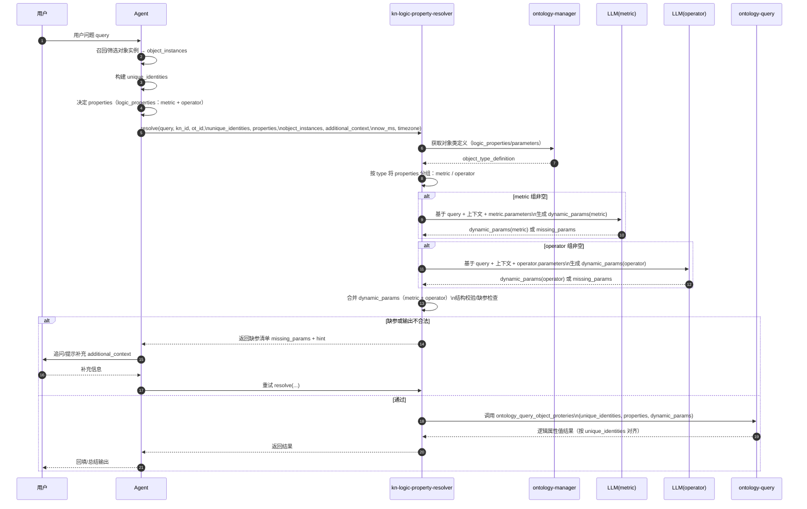

# kn-logic-property-resolver（Hybrid：Agent 编排 + 工具）方案设计（一页纸）

## 1. 目标

在“复合问题”场景下，让上游 Agent 能稳定完成：
- 先得到对象实例数据属性（召回/筛选）
- 再批量补齐这些对象的逻辑属性（metric + operator，本版本都需要支持）

其中 **kn-logic-property-resolver**（隶属于 `kn-context-loader` 工具集）负责：
- 内部拉取对象类定义（模式B）
- 组织上下文与 logic_properties 配置给大模型生成 `dynamic_params`
- 调用底层 `ontology_query_object_proteries` 查询逻辑属性并返回对齐结果
- 在缺参时返回“可驱动追问/补上下文”的结构化错误清单

## 2. 命名与术语（避免歧义）

- **kn-context-loader**：工具集（toolkit），面向“业务知识网络上下文获取/加载”的一组工具。
- **kn-logic-property-resolver（本工具）**：
  - **resolver = resolve + execute**：不仅生成 `dynamic_params`，还会调用底层接口执行查询并返回逻辑属性值。
  - 覆盖 `logic_properties`（metric + operator），不是普通 data_properties。

## 3. 参与组件与职责

- **Agent（上游编排）**：理解用户意图、确定 kn_id/ot_id、召回对象实例、决定 properties、组织上下文、回填结果；缺参时负责追问用户/补充上下文并重试。
- **kn-logic-property-resolver（工具）**：生成 dynamic_params + 调底层接口；不做代码语义规则识别（先交给大模型）。
- **ontology-manager**：提供对象类定义（logic_properties/parameters）。
- **ontology-query**：底层属性查询接口（输入 unique_identities/properties/dynamic_params）。
- **LLM 服务**：生成 dynamic_params（以及可选的 JSON 修复）。

## 4. 端到端流程（Hybrid 7步）

1) Agent 接收用户问题（复合问题）
2) Agent 确定 `kn_id`、`ot_id`
3) Agent 召回/筛选对象实例 → 得到 `object_instances` 并构建 `unique_identities`
4) Agent 决定要补齐的逻辑属性 → `properties`
5) Agent 组织上下文 → `query + object_instances + additional_context + now_ms/timezone ...`
6) Agent 调用 kn-logic-property-resolver：
   - kn-logic-property-resolver 内部拉 ontology-manager（模式B）并截取 `properties` 对应的 `logic_properties.parameters`
   - 调用 LLM 生成 `dynamic_params`
   - 调用 `ontology_query_object_proteries` 获取逻辑属性结果
7) Agent 回填并回答：
   - 成功：merge 回 object_instances
   - 缺参：基于缺参清单追问/补上下文 → 重试第6步

## 4.1 泳道流程图（Hybrid，推荐）

> 说明：进入 `kn-logic-property-resolver` 后，会先按对象类定义将 `properties` 分为 metric/operator 两组，
> 分别用不同的 LLM 提示词生成 `dynamic_params`，再合并后调用底层属性查询接口并返回。



## 5. 接口设计（对外）

### 5.1 Endpoint

- `POST /api/kn/logic-property-resolver`

### 5.2 Request Body（最小）
```json
{
  "kn_id": "",
  "ot_id": "",
  "query": "...",
  "unique_identities": [ { "...": "..." } ],
  "properties": [ "approved_drug_count", "business_health_score" ],
  "additional_context": "用途：给 LLM/Agent 补充生成 dynamic_params 所需的上下文（自由文本或 JSON 字符串均可，服务端不解析其结构）。建议至少包含：1) 对象实例关键信息（主键+必要字段）；2) 筛选/约束条件；3) 时间信息（now_ms/timezone/start/end/instant/step）；4) 针对某个 property 的补充说明（如有）。示例：company_id=company_000001，registered_capital=2000000；registered_capital>1000000；now_ms=1762996342241，timezone=Asia/Shanghai；趋势查询step=month/即时查询instant=true。",
  "options": {
    "return_debug": false,
    "max_repair_rounds": 1
  }
}
```

### 5.3 Response

- **成功**：透传底层 `ontology_query_object_proteries` 响应（`datas` 按 unique_identities 对齐）
- **失败（缺参/不合法）**：返回结构化错误（建议格式见第7节）

## 6. 依赖哪些接口（Dependencies）

### 6.1 ontology-manager（对象类定义）

- 用途：获取对象类定义，拿到 `logic_properties`，并按 `properties` 截取对应的 `parameters`
- 接口（示例，按你们现有文档口径）：`GET /api/ontology-manager/in/v1/knowledge-networks/{kn_id}/object-types/{ot_id}`
- 缓存策略：**暂不缓存，每次请求都获取**（后续可按需优化为按 kn_id+ot_id 缓存，配置 TTL）

### 6.2 ontology-query（底层逻辑属性值查询）

- 用途：实际执行逻辑属性值查询
- 接口：`POST /api/ontology-query/in/v1/knowledge-networks/{kn_id}/object-types/{ot_id}/properties`
- Header：`x-http-method-override: GET`、`x-account-id`、`x-account-type`
- Body：`{ unique_identities, properties, dynamic_params }`

### 6.3 LLM（动态参数生成，按类型/按属性并发）

- 用途：生成 `dynamic_params`
- 方式：
  - **按类型**：metric/operator 分别用各自提示词生成 dynamic_params
  - **按属性并发**：每个 property 独立生成（更利于并发与最小上下文）
- 说明：需要支持并发、失败重试与 JSON 修复

### 6.4 operator 服务（可选：用于 schema/示例，提升 operator 参数生成准确率）

> 说明：逻辑属性值的“执行”仍然走 `ontology-query` 的 properties 接口；operator 服务依赖主要用于**拿到算子入参 schema/openapi 元数据**，让 LLM 更准确生成复杂 Body/数组/对象参数。

- 获取算子详情（含 openapi 元数据、参数 schema、示例等）：
  - `GET /api/agent-operator-integration/internal-v1/operator/market/{operator_id}`
- 代理执行算子（通常**不需要**由本工具直接调用，除非你们未来要绕过 ontology-query）：
  - `POST /api/agent-operator-integration/internal-v1/operator/proxy/{operator_id}`

## 7. LLM 的提示词设计（metric + operator）

> 本节按“逻辑属性类型”分别定义提示词输入/输出/硬约束。推荐按 property 级别调用（便于并发与最小上下文）。

### 7.1 通用输入（两类共用）

- query
- kn_id / ot_id
- unique_identities
- additional_context（可选，包含对象实例信息、时间信息等上下文）
- now_ms / timezone（可选）
- 目标属性的 `logic_property` 配置（尤其是 `type / parameters / data_source`）

> **注**：`object_instances` 不再作为独立参数，对象实例信息统一通过 `additional_context` 传递。

### 7.2 通用输出（统一格式，便于合并与并发）

要求 LLM **只输出严格合法 JSON**，格式固定为：
```json
{
  "property_name": {
    "param1": value1,
    "param2": value2
  }
}
```

例如：
```json
{
  "approved_drug_count": {
    "instant": true,
    "start": 1762996342241,
    "end": 1762996342241
  }
}
```

缺参时输出（仍必须是合法 JSON）：
```json
{
  "_error": "缺少必填参数: start (时间范围开始时间戳), end (时间范围结束时间戳)"
}
```

### 7.3 metric 提示词（针对性设计）

- **只生成**该属性 `parameters` 中所有 `value_from:"input"` 的参数
- **固定系统项**：`instant/start/end/step`（`if_system_generate:true`）必须生成
- **step 枚举**：`day/week/month/quarter/year`（固定 1 个单位）
- **instant 定义**：`instant:true` 即时（单点）；`instant:false` 趋势（范围/序列，必须带 step）
- 其他 `value_from:"input"` 业务参数：尽量从 `additional_context/object_instances/query` 抽取；缺参则输出 missing_params

### 7.4 operator 提示词（针对性设计）

- **只生成**该属性 `parameters` 中所有 `value_from:"input"` 的参数
- operator 的参数可能来自 Path/Query/Body，但在本工具里统一表现为 `dynamic_params[property]` 的键值
- 参数值可能是基础类型/对象/数组（例如 projects 列表），必须保持结构可用
- **推荐补充 operator schema 输入**（若可用）：
  - 从 `logic_property.data_source.id` 得到 `operator_id`
  - 调用 `GET /operator/market/{operator_id}` 获取 openapi 元数据/参数 schema/示例，作为提示词的一部分
- 抽取优先级：`additional_context` > `query` >（schema 示例/默认值）；缺参输出 `_error`

## 8. kn-logic-property-resolver 内部处理（不做语义规则识别前提）

1) 拉取对象类定义（模式B）：`ontology-manager` 获取 ot 定义
2) 截取子集：仅保留本次 `properties` 对应的 `logic_properties` 配置（含 parameters）
3) 组装 prompt：输入 `query + unique_identities + additional_context + logic_properties(parameters)`，并加入硬约束：
   - metric：生成所有 `value_from:"input"` 参数；其中 `instant/start/end/step` 固定项
   - operator：生成所有 `value_from:"input"` 参数（可为基础类型/对象/数组），并保持其结构与类型要求
   - step 枚举：`day/week/month/quarter/year`（固定1单位）
   - instant：true=即时；false=趋势（false 必带 step）
   - 必须输出严格合法 JSON
4) LLM 生成 dynamic_params（以及完整请求体/或仅 dynamic_params，二选一；建议仅 dynamic_params 更短更稳）
5) 结构校验 + 修复（最多一次）：
   - JSON 合法
   - step 枚举合法
   - dynamic_params 必含每个 property
6) 调底层 `ontology_query_object_proteries` 并返回

## 8.1 并发策略（properties 多时的性能优化）

目标：当一次请求包含多个 `properties` 时，提升 LLM 生成 `dynamic_params` 的整体耗时表现。

核心思路：**按属性并发生成**。每个 property 的 `dynamic_params[property]` 是相互独立的（只依赖共享上下文 + 自身 parameters），可以并行调用 LLM，最终合并后再调用一次底层属性查询接口。

### 并发粒度选择（最终确定）

**按 property 并发（已确定）**
- 对每个 property 只喂"最小输入"：`query + unique_identities + additional_context + now_ms/timezone + 该 property 的 parameters`
- LLM 输出仅返回该 property 的 `dynamic_params[property]`
- 并发执行 N 个属性（不区分 metric/operator），最终合并成 `dynamic_params`
- 在主方法中统一控制 `max_concurrency`，使用信号量限制并发数

> **注**：对象实例信息（object_instances）统一通过 `additional_context` 传递，不再作为独立参数。

**核心流程**：
```
generateDynamicParams()
├── 准备阶段：遍历所有 properties
├── 并发调用 LLM（统一控制 max_concurrency）
│   ├── property1 (metric)   → buildPrompt → callLLM → validate
│   ├── property2 (operator) → buildPrompt → callLLM → validate
│   ├── property3 (metric)   → buildPrompt → callLLM → validate
│   └── ...（最多同时 max_concurrency 个）
└── 收集结果（成功的 + 缺参的）
```

### 并发上限（max_concurrency）

建议在 resolver 内实现"并发池"，设置 `max_concurrency`（默认 4）。
- 选择依据:平衡 LLM 网关限流(如 10 QPS)与延迟收益
- 可根据 LLM 服务 QPS 限制调整(3~8)
- 详见《05-并发策略与超时配置.md》

### 失败处理策略（确定方案）

**任一属性缺参/生成失败 → 整体失败**（返回缺参清单，交给 Agent 补充 additional_context 后由上游决定是否重试）。

**不支持部分成功**:
- 简化实现复杂度
- 避免上游需要处理"部分结果 + 部分缺参"的混合状态
- 失败时返回清晰的错误信息和缺参清单

### 限流与重试（确定方案）

- **LLM 调用失败**（429/5xx/超时）:指数退避重试(最多 2 次),仍失败则返回错误
- **其他依赖失败不重试**:ontology-manager/ontology-query 失败直接返回错误
- 每个 property 保留独立的 `span_id`,便于排障
- 详见《05-并发策略与超时配置.md》

### 合并与下游调用（保持一次性）

并发生成完成后：
- 合并得到完整 `dynamic_params`
- **一次**调用 `ontology_query_object_proteries`（批量 objects + 批量 properties），避免对下游造成多次压力

## 9. 缺参策略与重试机制

### 9.1 缺参处理(确定方案)

**缺参直接报错**,把补参动作交给 Agent(追问用户或补充 additional_context),并提供结构化清单用于驱动下一步。

缺参错误结构:
```json
{
  "error_code": "MISSING_INPUT_PARAMS",
  "message": "dynamic_params 缺少必需的 input 参数",
  "missing": [
    {
      "property": "approved_drug_count",
      "params": [
        { "name": "start", "type": "INTEGER", "hint": "需要时间范围，可从 query/now_ms 推断或由上游补 additional_context" }
      ]
    }
  ],
  "trace_id": "..."
}
```

### 9.2 重试机制(仅限 LLM 调用)

**只重试 LLM 调用失败**,不处理上游重试:
- 可重试错误:HTTP 429/5xx/网络超时
- 最多重试 2 次(含首次共 3 次调用)
- 指数退避:100ms → 200ms
- 不可重试:4xx(除429)/JSON解析失败/缺参错误

**其他依赖失败不重试**:
- ontology-manager 调用失败 → 直接返回错误给上游
- ontology-query 调用失败 → 透传错误给上游

### 9.3 now_ms / timezone 默认行为(最终确定)

- **now_ms**:若调用方不传,**由服务端取当前时间戳**(毫秒)并在 debug 中返回实际使用值
- **timezone**:暂不考虑(后续需要时再补充)

这确保:
- 即时查询(instant=true)总是可以生成 start/end
- 提示词不会因缺少 now_ms 而返回 `_error`

## 10. 关键共识（写死在实现里）

- 模式B：kn-logic-property-resolver 内部拉 ontology-manager（不考虑 branch/version）
- metric：必须生成所有 `value_from:"input"` 参数（系统项 + 业务项）
- operator：必须生成所有 `value_from:"input"` 参数（结构/类型由参数定义决定）
- step 枚举：day/week/month/quarter/year（固定1单位）
- instant：true=即时；false=趋势（false 必带 step）


