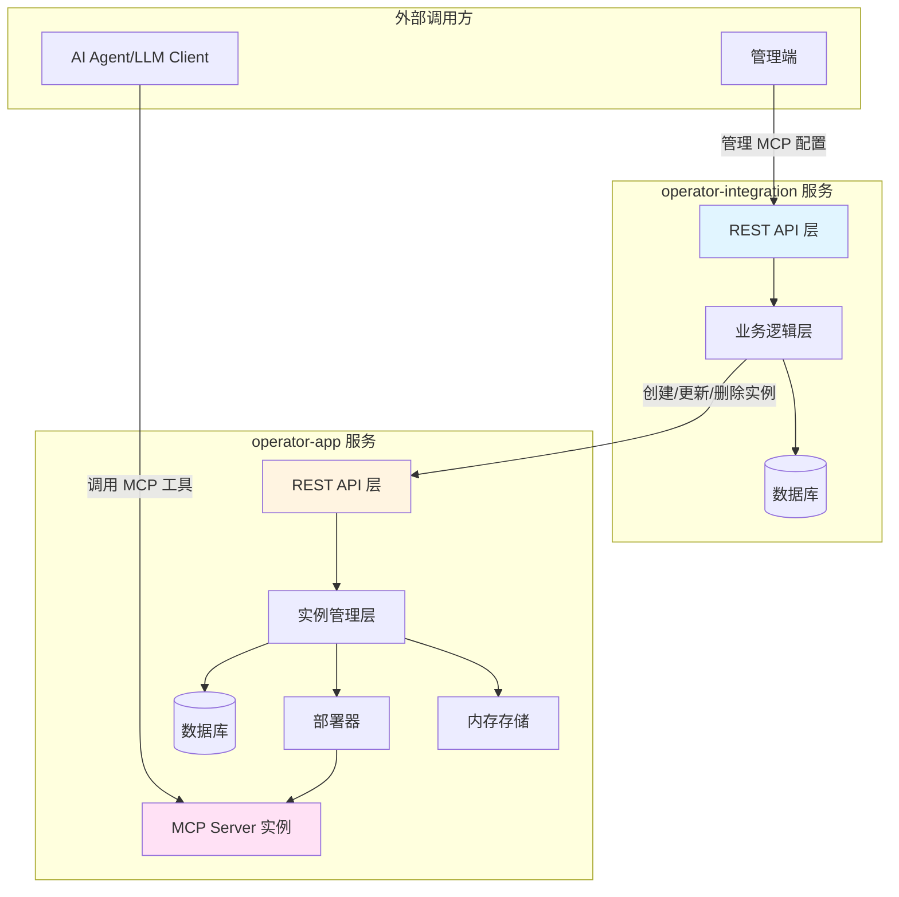
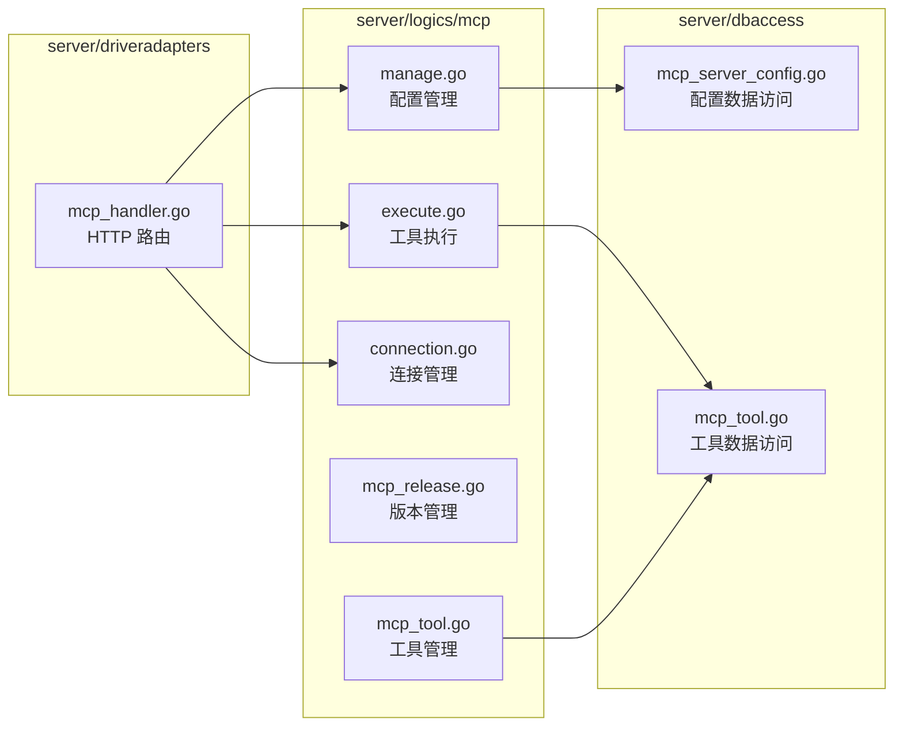
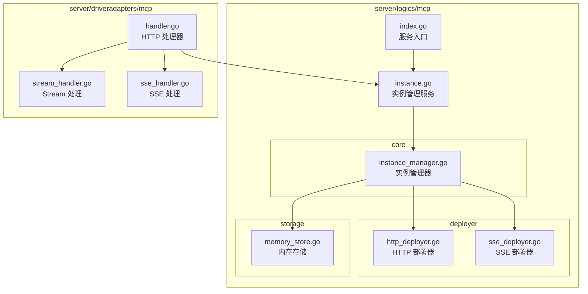
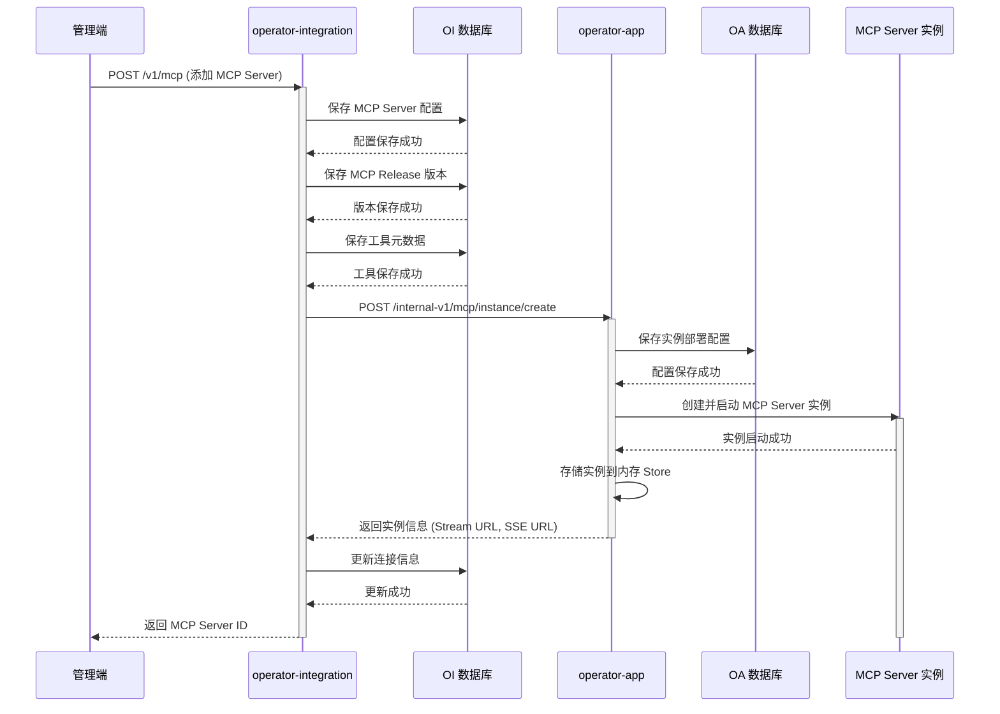
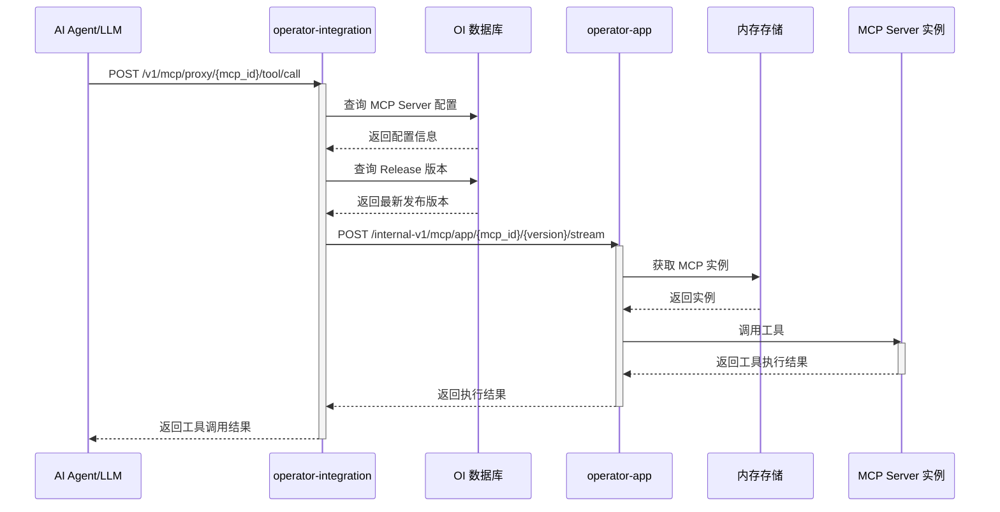
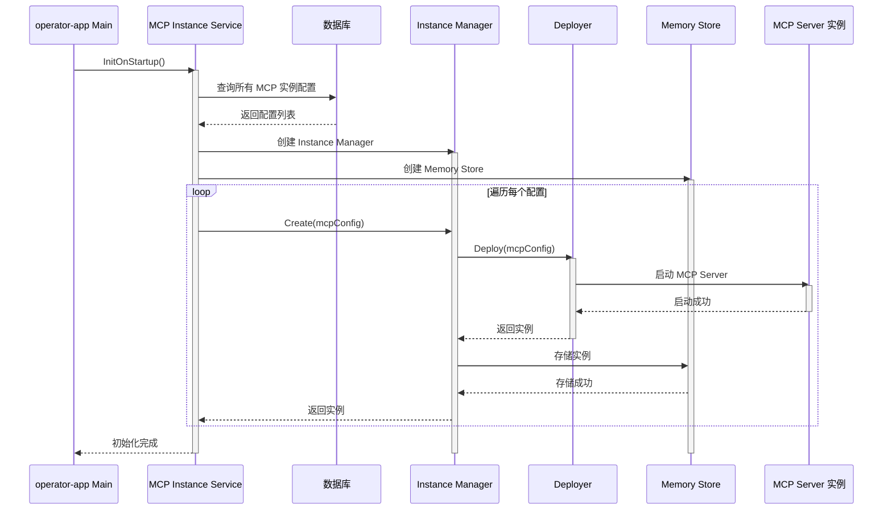

# MCP 功能迁移前架构与交互流程

## 1. 概述

在迁移之前，**Execution Factory** 由两个独立的服务组成：
- **operator-integration**：算子集成服务，负责算子和工具箱的全生命周期管理
- **operator-app**：应用侧运行时服务，负责 MCP Server 实例的部署和运行

这两个服务通过 HTTP API 进行交互，实现 MCP（Model Context Protocol）功能的完整流程。

## 2. 服务架构

### 2.1 整体架构图



### 2.2 服务职责划分

#### operator-integration 服务职责
1. **MCP Server 配置管理**
   - MCP Server 的注册、更新、删除
   - MCP Server 配置信息持久化
   - MCP Server 发布版本管理
   - MCP Server 市场列表查询

2. **MCP 工具管理**
   - 工具元数据管理
   - 工具与 Toolbox 的关联
   - 工具调试接口

3. **MCP Server 解析**
   - SSE 模式 MCP Server 解析
   - 工具列表获取

#### operator-app 服务职责
1. **MCP Server 实例运行时管理**
   - 实例的创建、更新、删除
   - 实例配置持久化到本地数据库
   - 实例生命周期管理

2. **MCP Server 实例部署**
   - HTTP/Stream 模式部署
   - SSE 模式部署
   - 实例路由注册

3. **MCP 协议端点服务**
   - Stream HTTP 端点
   - SSE 端点
   - Message 端点

## 3. 核心模块设计

### 3.1 operator-integration 核心模块



**关键文件说明：**
- `manage.go`: MCP Server 配置的 CRUD 操作、状态管理
- `execute.go`: 通过 HTTP 调用 operator-app 实现工具执行
- `connection.go`: MCP 连接信息管理
- `mcp_release.go`: MCP Server 发布版本管理
- `mcp_tool.go`: MCP 工具元数据管理

### 3.2 operator-app 核心模块



**关键文件说明：**
- `instance.go`: 实例服务实现，包含 CRUD、初始化启动等
- `instance_manager.go`: 实例管理核心逻辑
- `http_deployer.go` / `sse_deployer.go`: 不同协议模式的部署器
- `memory_store.go`: 内存级实例存储（全局单例）
- `stream_handler.go` / `sse_handler.go`: MCP 协议端点处理

## 4. 服务间交互流程

### 4.1 MCP Server 创建流程



**流程说明：**
1. 管理端调用 operator-integration 的 API 创建 MCP Server
2. operator-integration 将配置信息保存到自己的数据库
3. operator-integration 调用 operator-app 的内部 API 创建实例
4. operator-app 将实例配置保存到自己的数据库
5. operator-app 创建并启动 MCP Server 实例，存储到内存
6. operator-app 返回实例的访问端点
7. operator-integration 更新连接信息并返回给管理端

### 4.2 MCP 工具调用流程



**流程说明：**
1. 客户端通过 operator-integration 的代理接口调用工具
2. operator-integration 查询 MCP Server 配置和版本信息
3. operator-integration 转发请求到 operator-app
4. operator-app 从内存中获取对应的实例
5. operator-app 调用 MCP Server 实例执行工具
6. 结果逐层返回给客户端

### 4.3 MCP Server 实例更新流程

```mermaid
sequenceDiagram
    participant Admin as 管理端
    participant OI as operator-integration
    participant DB_OI as OI 数据库
    participant OA as operator-app
    participant DB_OA as OA 数据库
    participant OldMCP as 旧实例
    participant NewMCP as 新实例

    Admin->>OI: PUT /v1/mcp/{mcp_id} (更新配置)
    activate OI
    OI->>DB_OI: 更新 MCP Server 配置
    DB_OI-->>OI: 更新成功
    OI->>DB_OI: 创建新的 Release 版本
    DB_OI-->>OI: 版本创建成功

    OI->>OA: POST /internal-v1/mcp/instance/upgrade
    activate OA
    OA->>DB_OA: 检查实例是否存在
    DB_OA-->>OA: 返回检查结果

    alt 实例存在
        OA->>DB_OA: 更新实例配置
        DB_OA-->>OA: 更新成功
        OA->>OldMCP: 删除旧实例
        deactivate OldMCP
        OA->>NewMCP: 创建新实例
        activate NewMCP
        NewMCP-->>OA: 实例启动成功
    else 实例不存在
        OA->>DB_OA: 新建实例配置
        DB_OA-->>OA: 创建成功
        OA->>NewMCP: 创建新实例
        NewMCP-->>OA: 实例启动成功
    end

    OA->>OA: 更新内存 Store
    OA-->>OI: 返回新实例信息
    deactivate OA

    OI->>DB_OI: 更新连接信息
    DB_OI-->>OI: 更新成功
    OI-->>Admin: 返回更新结果
    deactivate OI
    deactivate NewMCP
```

### 4.4 系统启动时实例初始化流程



## 5. 数据存储设计

### 5.1 operator-integration 数据库表

**主要表结构：**

1. **mcp_server_config** - MCP Server 配置表
   - 字段：mcp_id, name, description, mode, url, command, args, headers, env, status, category 等
   - 用途：存储 MCP Server 的基本配置信息

2. **mcp_server_release** - MCP Server 发布版本表
   - 字段：mcp_id, version, status, created_at, updated_at 等
   - 用途：管理 MCP Server 的版本发布

3. **mcp_server_release_history** - 版本历史表
   - 字段：mcp_id, version, operation, operator, operated_at 等
   - 用途：记录版本操作历史

4. **mcp_tool** - MCP 工具表
   - 字段：tool_id, mcp_id, name, description, input_schema 等
   - 用途：存储工具元数据

### 5.2 operator-app 数据库表

**主要表结构：**

1. **resource_deploy** - 资源部署表
   - 字段：resource_id, type, version, name, description, config 等
   - 用途：存储 MCP 实例的部署配置（通用表，type='mcp'）

### 5.3 内存存储

operator-app 使用全局单例的内存存储 (`storage.MemoryStore`) 来管理运行时实例：

```go
type MemoryStore struct {
    instances map[string]*interfaces.MCPServerInstance
    // key 格式: "{mcp_id}:{version}"
}
```

**特点：**
- 单例模式，全局共享
- 仅存在于运行时内存
- 服务重启时需要从数据库重新加载

## 6. API 接口设计

### 6.1 operator-integration 对外 API

| 路径 | 方法 | 功能 |
|------|------|------|
| `/v1/mcp` | POST | 添加 MCP Server 配置 |
| `/v1/mcp/{mcp_id}` | GET | 查询 MCP Server 详情 |
| `/v1/mcp/{mcp_id}` | PUT | 更新 MCP Server 配置 |
| `/v1/mcp/{mcp_id}` | DELETE | 删除 MCP Server 配置 |
| `/v1/mcp/list` | GET | 查询 MCP Server 列表 |
| `/v1/mcp/{mcp_id}/status` | POST | 更新状态 |
| `/v1/mcp/proxy/{mcp_id}/tools` | GET | 获取工具列表 |
| `/v1/mcp/proxy/{mcp_id}/tool/call` | POST | 调用工具 |
| `/v1/mcp/parse/sse` | POST | 解析 SSE 模式 MCP |
| `/v1/mcp/market/list` | GET | 查询市场列表 |

### 6.2 operator-integration 内部 API（调用 operator-app）

| 路径 | 方法 | 功能 |
|------|------|------|
| `/internal-v1/mcp/instance/create` | POST | 创建实例 |
| `/internal-v1/mcp/instance/update/:mcp_id/:version` | PUT | 更新实例 |
| `/internal-v1/mcp/instance/remove/:mcp_id/:version` | DELETE | 删除指定版本实例 |
| `/internal-v1/mcp/instance/remove/:mcp_id` | DELETE | 删除所有版本实例 |
| `/internal-v1/mcp/instance/upgrade` | POST | 升级实例 |
| `/internal-v1/mcp/app/:mcp_id/:version/stream` | ANY | Stream 端点 |
| `/internal-v1/mcp/app/:mcp_id/:version/sse` | GET | SSE 端点 |
| `/internal-v1/mcp/app/:mcp_id/:version/message` | POST | Message 端点 |

## 7. 关键技术特点

### 7.1 服务分离的优势
- **职责清晰**：配置管理与运行时分离
- **独立部署**：两个服务可以独立扩展
- **故障隔离**：一个服务故障不影响另一个

### 7.2 存在的问题
- **网络开销**：服务间通过 HTTP 调用，增加延迟
- **数据一致性**：配置在两个数据库中都有存储，需要保证一致性
- **运维复杂度**：需要维护两个服务、两个数据库
- **实例管理**：operator-app 使用全局单例内存存储，扩展性受限
- **故障恢复**：operator-app 重启时需要从数据库重新加载所有实例

## 8. 总结

迁移前的架构采用**双服务模式**，operator-integration 负责配置管理，operator-app 负责实例运行。这种设计在职责分离上较为清晰，但存在服务间通信开销、数据一致性维护、运维复杂度高等问题。

迁移的主要目标是将 operator-app 的 MCP 实例管理功能整合到 operator-integration 中，实现**单服务架构**，简化系统复杂度，提升性能和可维护性。
