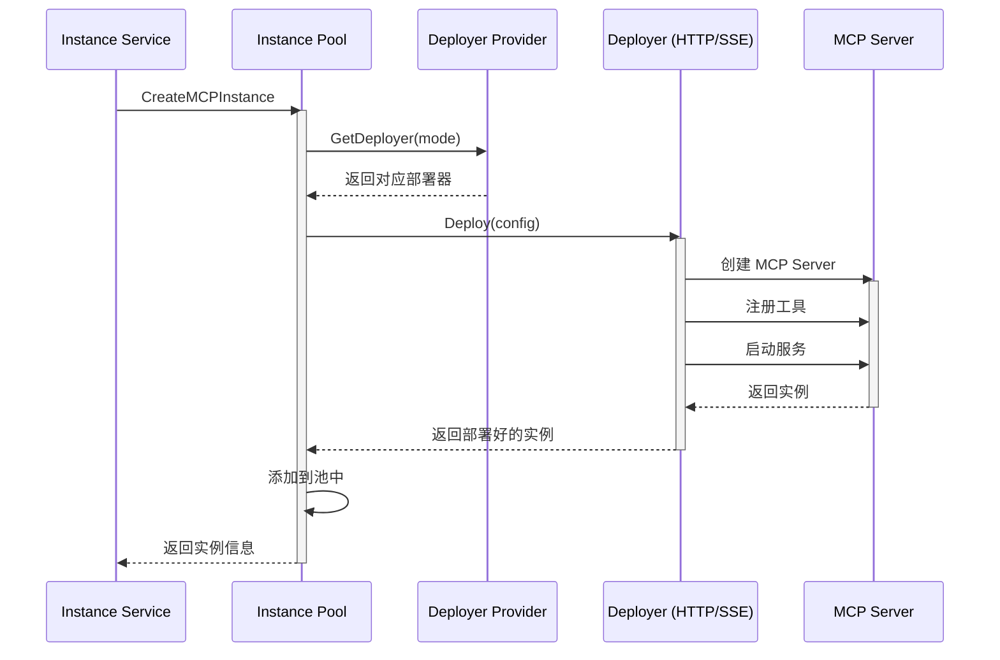
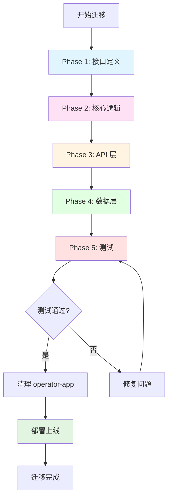
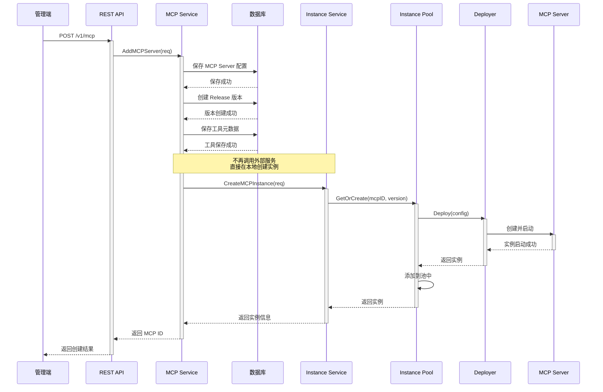

# MCP 功能整体迁移方案

## 1. 迁移目标

将 **operator-app** 服务中的 MCP 实例管理功能迁移到 **operator-integration** 服务，实现服务合并，简化系统架构。

### 1.1 核心目标
1. **服务合并**：将两个服务合并为一个服务（operator-integration）
2. **功能完整**：保留所有 MCP 相关功能，不降低功能性
3. **性能优化**：消除服务间 HTTP 调用开销，提升响应速度
4. **简化运维**：减少服务数量和数据库，降低运维复杂度
5. **平滑过渡**：确保 API 接口兼容，最小化对调用方的影响

### 1.2 迁移范围

**需要迁移的模块：**
- MCP 实例服务逻辑（`server/logics/mcp/`）
- MCP 实例部署器（`server/logics/mcp/deployer/`）
- MCP 实例存储（`server/logics/mcp/storage/`）
- MCP 实例核心管理（`server/logics/mcp/core/`）
- MCP 协议端点处理器（`server/driveradapters/mcp/`）
- MCP 实例相关数据库访问层（`server/dbaccess/`）

**不需要迁移的模块：**
- operator-app 的 demo 模块（演示代码）
- operator-app 的基础设施配置（已在 operator-integration 中存在）

## 2. 迁移策略

### 2.1 总体策略

采用**重构式迁移**策略，而非简单的代码复制：


### 2.2 分阶段执行

**Phase 1: 接口定义迁移**
- 迁移 MCP 实例相关接口定义到 `server/interfaces/`
- 统一接口命名和数据结构
- 定义新的 InstanceService 接口

**Phase 2: 核心逻辑迁移**
- 迁移实例管理器（Instance Manager）
- 迁移部署器（Deployer）
- 迁移存储层（Storage）
- 重构为符合 operator-integration 架构风格的代码

**Phase 3: API 层整合**
- 迁移 HTTP 处理器
- 整合路由注册
- 统一中间件和错误处理

**Phase 4: 数据层整合**
- 合并数据库表设计
- 迁移数据访问层代码

**Phase 5: 测试与优化**
- 单元测试
- 集成测试
- 性能测试
- 文档更新

## 3. 详细迁移方案

### 3.1 接口定义迁移

**目标：** 在 `operator-integration/server/interfaces/` 中定义统一的 MCP 实例接口

**新增文件：**
- `mcp_instance.go` - MCP 实例相关接口定义

**接口设计：**

```go
// InstanceService MCP 实例服务接口
type InstanceService interface {
    // 创建 MCP 实例
    CreateMCPInstance(ctx context.Context, req *MCPInstanceCreateRequest) (*MCPInstanceCreateResponse, error)

    // 更新 MCP 实例
    UpdateMCPInstance(ctx context.Context, mcpID string, version int, req *MCPInstanceUpdateRequest) (*MCPInstanceUpdateResponse, error)

    // 删除指定版本的 MCP 实例
    DeleteMCPInstance(ctx context.Context, mcpID string, version int) error

    // 删除 MCP ID 的所有实例
    DeleteAllMCPInstances(ctx context.Context, mcpID string) error

    // 升级 MCP 实例（创建或更新）
    UpgradeMCPInstance(ctx context.Context, req *MCPInstanceCreateRequest) (*MCPInstanceCreateResponse, error)

    // 获取 MCP 实例
    GetMCPInstance(ctx context.Context, mcpID string, version int) (*MCPServerInstance, error)
}

// MCPServerInstance MCP Server 运行时实例
type MCPServerInstance struct {
    Config           *MCPRuntimeConfig
    MCPServer        *server.MCPServer
    StreamServer     *server.StreamableHTTPServer
    SSEServer        *server.SSEServer
    StreamRoutePath  string
    SSERoutePath     string
    MessageRoutePath string
    IsDisabled       bool
    CreatedAt        *time.Time
    ActiveStreamConn int64  // 活跃 Stream 连接数
    ActiveSSEConn    int64  // 活跃 SSE 连接数
}

// MCPRuntimeConfig MCP 运行时配置
type MCPRuntimeConfig struct {
    MCPID        string
    Version      int
    Name         string
    Instructions string
    CreationType string
    Tools        []*MCPToolDeployConfig
}
```

**迁移动作：**
1. 创建 `server/interfaces/mcp_instance.go`
2. 定义上述接口和数据结构
3. 使用 `//go:generate mockgen` 生成 mock 文件

### 3.2 核心逻辑迁移

**目标：** 将实例管理、部署、存储逻辑迁入 operator-integration

#### 3.2.1 目录结构设计

```
operator-integration/server/
├── logics/
│   ├── mcp/              # 原有 MCP 配置管理逻辑
│   │   ├── manage.go
│   │   ├── execute.go
│   │   ├── connection.go
│   │   └── ...
│   └── mcpinstance/      # 新增：MCP 实例管理逻辑
│       ├── service.go         # 实例服务实现
│       ├── instance_manager.go # 实例管理器
│       ├── pool.go            # 实例池（新增，替换全局单例）
│       ├── tool_manager.go    # 工具管理器
│       └── deployer/          # 部署器目录
│           ├── http_deployer.go
│           ├── sse_deployer.go
│           └── provider.go    # 部署器提供者
```

**设计说明：**
- 新建 `mcpinstance` 包，与现有 `mcp` 包并列
- `mcp` 包负责配置管理，`mcpinstance` 包负责实例运行时管理
- 使用实例池（Pool）替代全局单例存储，支持更好的生命周期管理

#### 3.2.2 实例池设计（重要改进）

**原 operator-app 设计问题：**
```go
// 全局单例，所有实例永久保留在内存
var globalStore = &MemoryStore{
    instances: make(map[string]*MCPServerInstance),
}
```

**新设计（实例池）：**

```go
// InstancePool 实例池，支持 LRU 淘汰和 TTL
type InstancePool struct {
    maxSize      int                              // 最大实例数
    ttl          time.Duration                    // 实例存活时间
    instances    map[string]*MCPServerInstance    // 实例映射
    lruList      *list.List                       // LRU 链表
    mu           sync.RWMutex                     // 读写锁
}

// 特性：
// 1. LRU 淘汰：当池满时，淘汰最少使用的实例
// 2. TTL 过期：实例空闲超过 TTL 自动清理
// 3. 活跃保护：有活跃连接的实例不会被淘汰
// 4. 懒加载：实例首次访问时创建，而非启动时全部加载
```

**优势：**
- 内存可控：避免无限增长
- 性能优化：减少不必要的实例常驻
- 灵活扩展：支持配置池大小和 TTL

#### 3.2.3 服务实现迁移

**文件：** `server/logics/mcpinstance/service.go`

**实现要点：**
```go
type instanceService struct {
    Logger              interfaces.Logger
    Pool                *InstancePool
    DBMCPServerConfig   interfaces.MCPServerConfigDBAccess
    DBMCPServerRelease  interfaces.MCPServerReleaseDBAccess
    DBMCPTool           interfaces.MCPToolDBAccess
    DBTx                interfaces.TxDBAccess
}

// CreateMCPInstance 实现
func (s *instanceService) CreateMCPInstance(ctx context.Context, req *MCPInstanceCreateRequest) (*MCPInstanceCreateResponse, error) {
    // 1. 验证参数
    // 2. 检查实例是否已存在
    // 3. 部署 MCP Server 实例（通过 Deployer）
    // 4. 注册到实例池
    // 5. 返回实例信息（Stream URL, SSE URL）
}
```

**关键区别：**
- 使用实例池而非全局单例

#### 3.2.4 部署器迁移

**文件：**
- `server/logics/mcpinstance/deployer/http_deployer.go`
- `server/logics/mcpinstance/deployer/sse_deployer.go`
- `server/logics/mcpinstance/deployer/provider.go`

**部署流程：**



### 3.3 API 层整合

#### 3.3.1 路由整合

**文件：** `server/driveradapters/mcp_handler.go`

**新增路由：**

```go
// RegisterPublic 公开 API
func (r *mcpRestHandler) RegisterPublic(engine *gin.RouterGroup) {
    mcpGroup := engine.Group("/mcp")

    // ... 原有配置管理接口 ...

    // 新增：MCP endpoint 相关接口
    // Streamable Http Endpoint
    mcpGroup.Any("/app/:mcp_id/mcp", r.MCPPublicHandler.HandleStreamingHttp)
    // SSE Endpoint
    mcpGroup.GET("/app/:mcp_id/sse", r.MCPPublicHandler.HandleServerSentEvents)
    // Message endpoint
    mcpGroup.POST("/app/:mcp_id/message", r.MCPPublicHandler.HandleSSEMessage)
}

// RegisterPrivate 内部 API（已不需要，可逐步废弃）
func (r *mcpRestHandler) RegisterPrivate(engine *gin.RouterGroup) {
    mcpGroup := engine.Group("/mcp")

    // 内部 MCP 代理接口（供其他服务调用）
    mcpProxyGroup := mcpGroup.Group("/proxy")
    mcpProxyGroup.GET("/:mcp_id/tools", r.MCPPrivateHandler.GetMCPTools)
    mcpProxyGroup.POST("/:mcp_id/tool/call", r.MCPPrivateHandler.CallMCPTool)

    // 内置 MCP 注册接口
    mcpGroup.POST("/intcomp/register", middlewareBusinessDomain(true, true), r.MCPPrivateHandler.RegisterBuiltinMCPServerPrivate)
    mcpGroup.POST("/intcomp/unregister/:mcp_id", middlewareBusinessDomain(true, true), r.MCPPrivateHandler.UnregisterBuiltinMCPServerPrivate)
}
```

**URL 路径变化：**

| 原 operator-app 路径 | 新 operator-integration 路径 | 说明 |
|---------------------|---------------------------|------|
| `/internal-v1/mcp/app/:mcp_id/:version/stream` | `/v1/mcp/app/:mcp_id/mcp` | Stream 端点，去除 version |
| `/internal-v1/mcp/app/:mcp_id/:version/sse` | `/v1/mcp/app/:mcp_id/sse` | SSE 端点，去除 version |
| `/internal-v1/mcp/app/:mcp_id/:version/message` | `/v1/mcp/app/:mcp_id/message` | Message 端点，去除 version |

**版本处理：**
- 不再在 URL 中指定 version
- 自动使用最新发布版本（从 `mcp_server_release` 表查询）
- 简化 API 调用

#### 3.3.2 Handler 迁移

**文件：** `server/driveradapters/mcp/handler.go`

**新增方法：**

```go
// HandleStreamingHttp 处理 Stream HTTP 请求
func (h *mcpHandler) HandleStreamingHttp(c *gin.Context) {
    mcpID := c.Param("mcp_id")

    // 1. 查询最新发布版本
    release, err := h.MCPService.GetLatestRelease(c.Request.Context(), mcpID)
    if err != nil {
        // 错误处理
        return
    }

    // 2. 从实例池获取或创建实例
    instance, err := h.InstanceService.GetMCPInstance(c.Request.Context(), mcpID, release.Version)
    if err != nil {
        // 错误处理
        return
    }

    // 3. 增加活跃连接计数
    atomic.AddInt64(&instance.ActiveStreamConn, 1)
    defer atomic.AddInt64(&instance.ActiveStreamConn, -1)

    // 4. 代理请求到 MCP Server
    instance.StreamServer.ServeHTTP(c.Writer, c.Request)
}

// HandleServerSentEvents 处理 SSE 请求
func (h *mcpHandler) HandleServerSentEvents(c *gin.Context) {
    // 类似实现，使用 SSEServer
}

// HandleSSEMessage 处理 SSE Message 请求
func (h *mcpHandler) HandleSSEMessage(c *gin.Context) {
    // 类似实现，处理 SSE 消息
}
```

**关键点：**
- 活跃连接计数：保护正在使用的实例不被淘汰
- 版本自动解析：从 Release 表获取最新版本
- 实例懒加载：访问时才创建实例

### 3.4 数据层整合

#### 3.4.1 数据库表设计

**迁移前 operator-app 表：**
- `resource_deploy` - 通用资源部署表

**迁移后复用 operator-integration 表：**
- `mcp_server_config` - MCP Server 配置（已存在）
- `mcp_server_release` - 发布版本（已存在）
- `mcp_tool` - 工具元数据（已存在）

**结论：** 不需要新增表，复用现有表即可

#### 3.4.2 数据访问层

**复用现有 DBAccess：**
- `server/dbaccess/mcp_server_config.go`
- `server/dbaccess/mcp_server_release.go`
- `server/dbaccess/mcp_tool.go`

**无需迁移**，直接注入到 `instanceService` 中使用。

### 3.5 启动流程整合

**原 operator-app 启动流程：**
```go
// server/main.go
func (s *Server) Start() {
    // 初始化 mcp 服务实例
    mcpInstanceService := mcp.NewMCPInstanceService()
    err := mcpInstanceService.InitOnStartup(context.Background())
    // ...
}
```

**新 operator-integration 启动流程：**
```go
// server/main.go
func (s *Server) Start() {
    // ... 原有启动逻辑 ...

    // 初始化 MCP 实例池（启用后台清理）
    instancePool := mcpinstance.NewInstancePool(
        maxSize: 100,
        ttl: 30 * time.Minute,
    )
    instancePool.StartBackgroundCleanup()

    // 注册到服务容器
    // ...
}
```

**区别：**
- 不再在启动时加载所有实例
- 使用实例池，支持懒加载和自动清理
- 更轻量的启动过程

## 4. 迁移流程图

### 4.1 整体迁移流程



### 4.2 MCP Server 创建流程（迁移后）



**关键改进：**
- 消除服务间 HTTP 调用
- 减少网络延迟
- 简化错误处理

## 5. 风险与应对

### 5.1 技术风险

| 风险 | 影响 | 应对措施 |
|------|------|----------|
| 实例池设计缺陷 | 内存溢出或实例丢失 | 充分测试，添加监控告警 |
| 并发问题 | 数据竞争，状态不一致 | 使用读写锁，添加并发测试 |
| 版本兼容性 | API 调用方受影响 | 保留兼容层，逐步废弃旧接口 |
| 性能回退 | 响应变慢 | 性能基准测试，对比迁移前后 |

### 5.2 数据风险

| 风险 | 影响 | 应对措施 |
|------|------|----------|
| 数据丢失 | 历史配置丢失 | 数据备份，迁移脚本验证 |
| 数据不一致 | 配置错乱 | 数据校验，回滚方案 |

### 5.3 运维风险

| 风险 | 影响 | 应对措施 |
|------|------|----------|
| 部署失败 | 服务不可用 | 灰度发布，快速回滚机制 |
| 监控缺失 | 问题无法及时发现 | 完善监控指标和告警 |

## 6. 测试方案

### 6.1 单元测试

**测试重点：**
- 实例池的 CRUD 操作
- LRU 淘汰逻辑
- TTL 过期逻辑
- 活跃连接保护
- 部署器功能

**Mock 对象：**
- DBAccess 层
- MCP Server 实例

### 6.2 集成测试

**测试场景：**
1. 创建 MCP Server 配置
2. 首次访问时自动创建实例
3. 多次访问同一实例（缓存命中）
4. 实例池满时的淘汰
5. 实例过期清理
6. 实例更新和删除

### 6.3 压力测试

**测试指标：**
- 并发请求处理能力
- 内存使用情况
- 实例池命中率
- 响应时间分布

### 6.4 兼容性测试

**验证内容：**
- API 接口向后兼容
- 客户端调用正常
- 数据迁移完整

## 7. 上线方案

### 7.1 灰度发布

**阶段 1：内部测试（1 周）**
- 部署到测试环境
- 内部团队测试
- 修复问题

**阶段 2：小流量灰度（1 周）**
- 5% 流量切换到新服务
- 监控指标和错误日志
- 对比新旧服务性能

**阶段 3：逐步放量（2 周）**
- 20% -> 50% -> 100%
- 持续监控
- 保留回滚能力

**阶段 4：完全切换（1 天）**
- 100% 流量切换
- 关闭 operator-app 服务
- 清理旧代码和配置

### 7.2 回滚方案

**条件：**
- 错误率超过阈值（如 1%）
- 性能下降超过 20%
- 发现重大 Bug

**步骤：**
1. 流量切回 operator-app
2. 分析问题原因
3. 修复后重新灰度

## 8. 后续优化

### 8.1 功能优化

1. **实例预热**：预先创建常用实例
2. **多级缓存**：实例 + 配置缓存
3. **异步清理**：后台异步清理过期实例
4. **健康检查**：定期检查实例健康状态

### 8.2 性能优化

1. **连接池复用**：复用 HTTP 客户端
2. **批量操作**：支持批量创建和删除
3. **读写分离**：实例池读写分离

### 8.3 可观测性

1. **指标监控**：
   - 实例池大小
   - 命中率
   - 淘汰次数
   - 活跃连接数

2. **日志增强**：
   - 结构化日志
   - 调用链追踪
   - 慢查询日志

3. **告警规则**：
   - 实例池使用率告警
   - 实例创建失败告警
   - 响应时间告警

## 9. 总结

本迁移方案通过重构式迁移，将 operator-app 的 MCP 实例管理功能整合到 operator-integration 中，实现了：

1. **架构简化**：两个服务合并为一个
2. **性能提升**：消除服务间调用开销
3. **运维简化**：减少运维复杂度
4. **功能增强**：实例池支持更好的资源管理

关键技术改进：
- 使用实例池替代全局单例
- 支持 LRU 淘汰和 TTL 过期
- 实例懒加载和活跃连接保护
- 自动版本解析

通过分阶段、灰度发布的方式，确保迁移过程平滑、安全、可回滚。
