# MCP 功能迁移后架构与交互流程

## 1. 概述

迁移完成后，**Execution Factory** 整合为单一的 **operator-integration** 服务，所有 MCP（Model Context Protocol）相关功能均在该服务内实现，包括：
- MCP Server 配置管理
- MCP Server 实例运行时管理
- MCP 协议端点服务
- 工具调用和执行

这种**单服务架构**消除了服务间通信开销，简化了部署和运维，提升了整体性能。

## 2. 整体架构

### 2.1 系统架构图

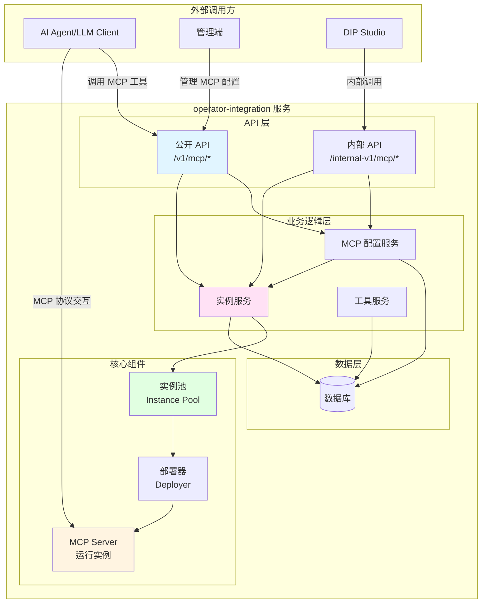

### 2.2 与迁移前架构对比

| 对比项 | 迁移前 | 迁移后 |
|--------|--------|--------|
| **服务数量** | 2 个（operator-integration + operator-app） | 1 个（operator-integration） |
| **数据库** | 2 个独立数据库 | 1 个统一数据库 |
| **配置存储** | 分散在两个服务 | 统一在 mcp_server_config 表 |
| **实例管理** | operator-app 全局单例 | operator-integration 实例池 |
| **服务间通信** | HTTP 跨服务调用 | 本地方法调用 |
| **实例生命周期** | 永久保留，重启重建 | 懒加载 + LRU 淘汰 + TTL 过期 |
| **版本管理** | URL 中显式指定 | 自动使用最新发布版本 |
| **扩展性** | 受全局单例限制 | 实例池可配置大小和策略 |

## 3. 核心模块设计

### 3.1 模块层次结构

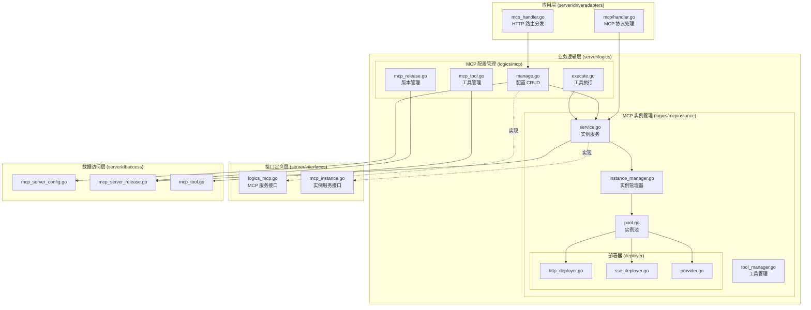

### 3.2 目录结构

```
operator-integration/
├── server/
│   ├── driveradapters/          # HTTP 适配层
│   │   ├── mcp_handler.go       # MCP 路由注册
│   │   └── mcp/                 # MCP 协议处理
│   │       ├── handler.go       # 基础处理器
│   │       ├── stream_handler.go # Stream 端点
│   │       └── sse_handler.go   # SSE 端点
│   ├── logics/                  # 业务逻辑层
│   │   ├── mcp/                 # MCP 配置管理
│   │   │   ├── index.go
│   │   │   ├── manage.go        # 配置 CRUD
│   │   │   ├── execute.go       # 工具执行
│   │   │   ├── connection.go    # 连接管理
│   │   │   ├── mcp_release.go   # 版本管理
│   │   │   ├── mcp_tool.go      # 工具管理
│   │   │   └── ...
│   │   └── mcpinstance/         # MCP 实例管理（新增）
│   │       ├── service.go       # 实例服务实现
│   │       ├── instance_manager.go # 实例管理器
│   │       ├── pool.go          # 实例池
│   │       ├── tool_manager.go  # 工具管理器
│   │       └── deployer/        # 部署器
│   │           ├── http_deployer.go
│   │           ├── sse_deployer.go
│   │           └── provider.go
│   ├── interfaces/              # 接口定义层
│   │   ├── logics_mcp.go       # MCP 服务接口
│   │   ├── mcp_instance.go     # 实例服务接口（新增）
│   │   └── ...
│   ├── dbaccess/                # 数据库访问层
│   │   ├── mcp_server_config.go
│   │   ├── mcp_server_release.go
│   │   ├── mcp_tool.go
│   │   └── ...
│   ├── infra/                   # 基础设施
│   │   ├── config/              # 配置管理
│   │   └── ...
│   └── main.go                  # 服务入口
├── docs/                        # 文档
│   ├── migration/               # 迁移文档
│   └── ...
└── ...
```

## 4. 核心组件详解

### 4.1 实例池 (Instance Pool)

实例池是迁移后的核心改进，负责 MCP Server 实例的生命周期管理。

#### 4.1.1 设计原理

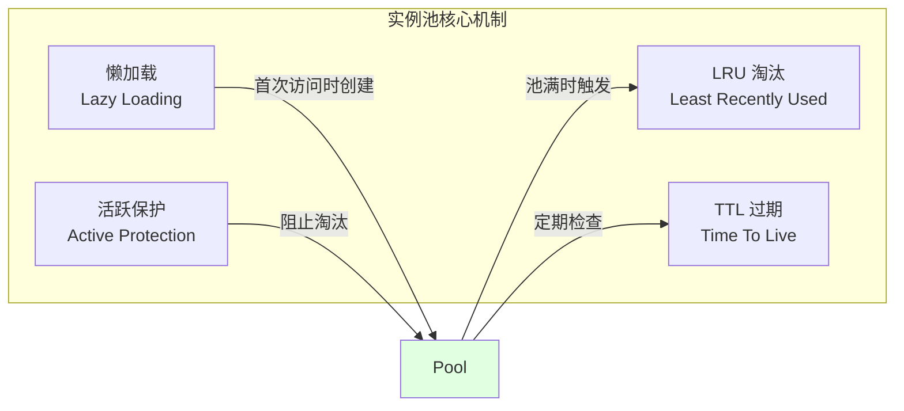

#### 4.1.2 数据结构

```go
type InstancePool struct {
    maxSize      int                              // 最大实例数
    ttl          time.Duration                    // 实例存活时间
    instances    map[string]*poolItem             // 实例映射
    lruList      *list.List                       // 双向链表，维护 LRU
    mu           sync.RWMutex                     // 读写锁
    cleanupStop  chan struct{}                    // 清理协程停止信号
}

type poolItem struct {
    key       string                  // mcpID:version
    instance  *MCPServerInstance      // MCP 实例
    element   *list.Element           // LRU 链表节点
    lastUsed  time.Time              // 最后使用时间
}
```

#### 4.1.3 核心方法

```go
// GetOrCreate 获取或创建实例（懒加载）
func (p *InstancePool) GetOrCreate(ctx context.Context, mcpID string, version int) (*MCPServerInstance, error)

// Evict 淘汰最少使用的实例
func (p *InstancePool) Evict() error

// Cleanup 清理过期实例
func (p *InstancePool) Cleanup() int

// StartBackgroundCleanup 启动后台清理协程
func (p *InstancePool) StartBackgroundCleanup()
```

#### 4.1.4 工作流程

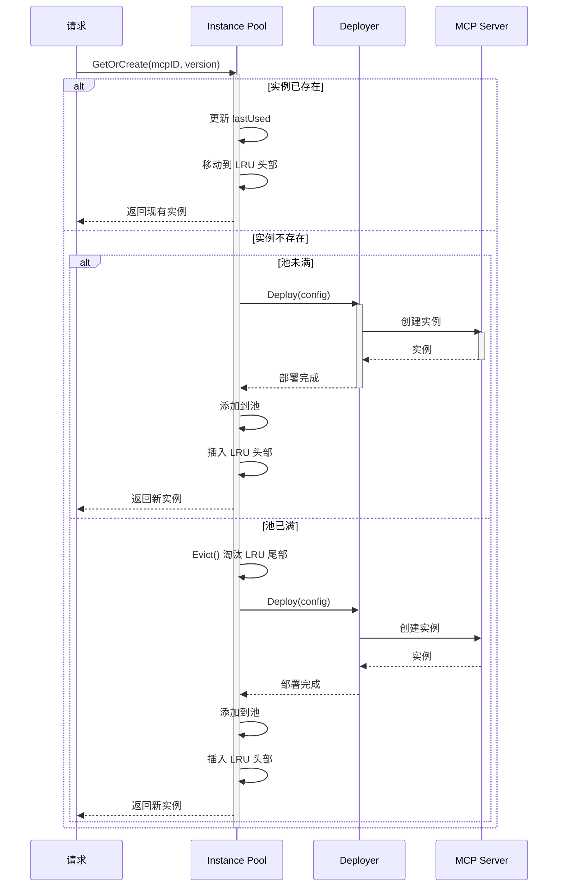

#### 4.1.5 实例保护机制

**活跃连接保护：**

```go
// 在 Handler 中增加活跃连接计数
func (h *mcpHandler) HandleStreamingHttp(c *gin.Context) {
    instance, _ := h.Pool.GetOrCreate(ctx, mcpID, version)

    // 增加活跃连接数
    atomic.AddInt64(&instance.ActiveStreamConn, 1)
    defer atomic.AddInt64(&instance.ActiveStreamConn, -1)

    // 代理请求
    instance.StreamServer.ServeHTTP(c.Writer, c.Request)
}

// 在淘汰时检查
func (p *InstancePool) Evict() error {
    // 从 LRU 尾部开始查找可淘汰的实例
    for e := p.lruList.Back(); e != nil; e = e.Prev() {
        item := e.Value.(*poolItem)

        // 跳过有活跃连接的实例
        if atomic.LoadInt64(&item.instance.ActiveStreamConn) > 0 ||
           atomic.LoadInt64(&item.instance.ActiveSSEConn) > 0 {
            continue
        }

        // 淘汰该实例
        // ...
    }
}
```

### 4.2 部署器 (Deployer)

部署器负责根据不同的 MCP 模式创建和启动 MCP Server 实例。

#### 4.2.1 部署器类型

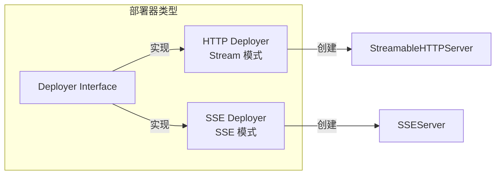

#### 4.2.2 部署流程

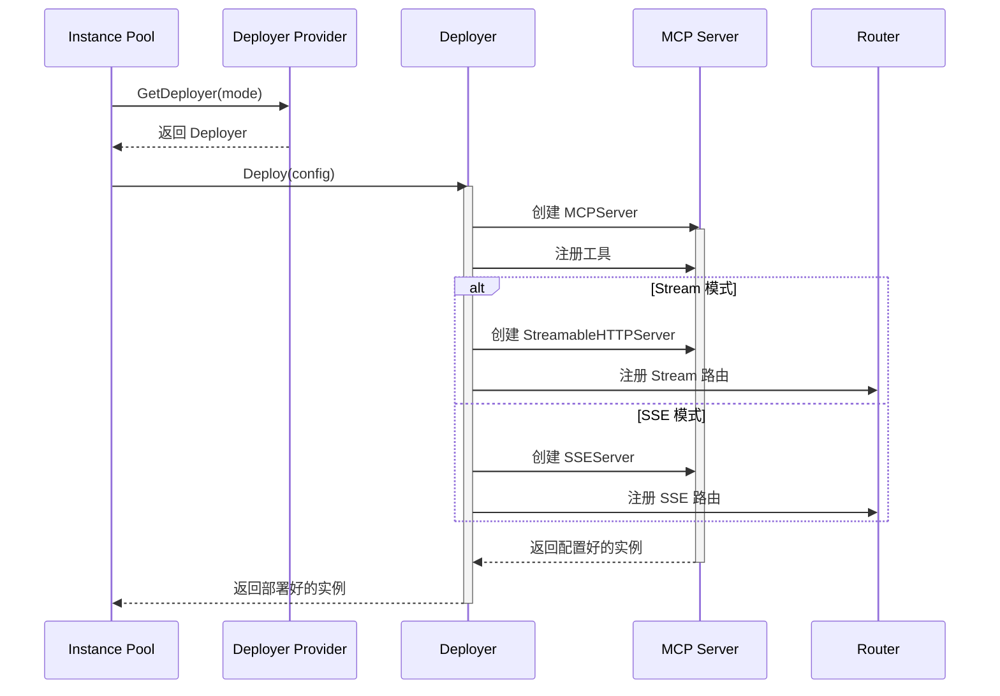

### 4.3 版本管理

迁移后使用自动版本解析机制，简化 API 调用。

#### 4.3.1 版本解析流程

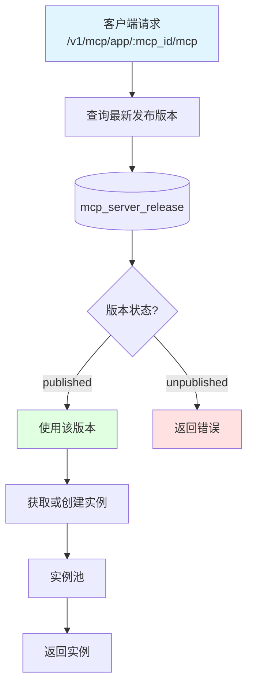

#### 4.3.2 版本状态机

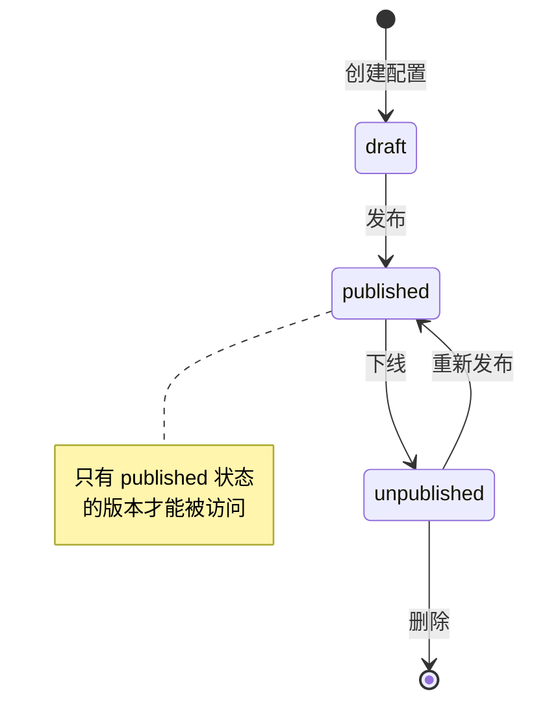

## 5. 数据模型

### 5.1 数据库表结构

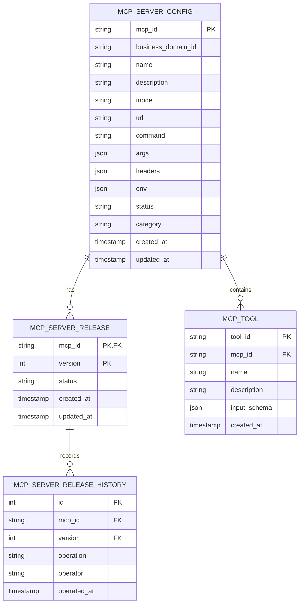

### 5.2 实例池内存结构

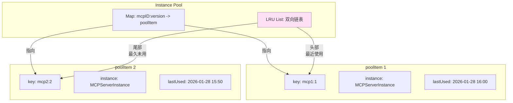

## 6. 交互流程

### 6.1 MCP Server 创建流程

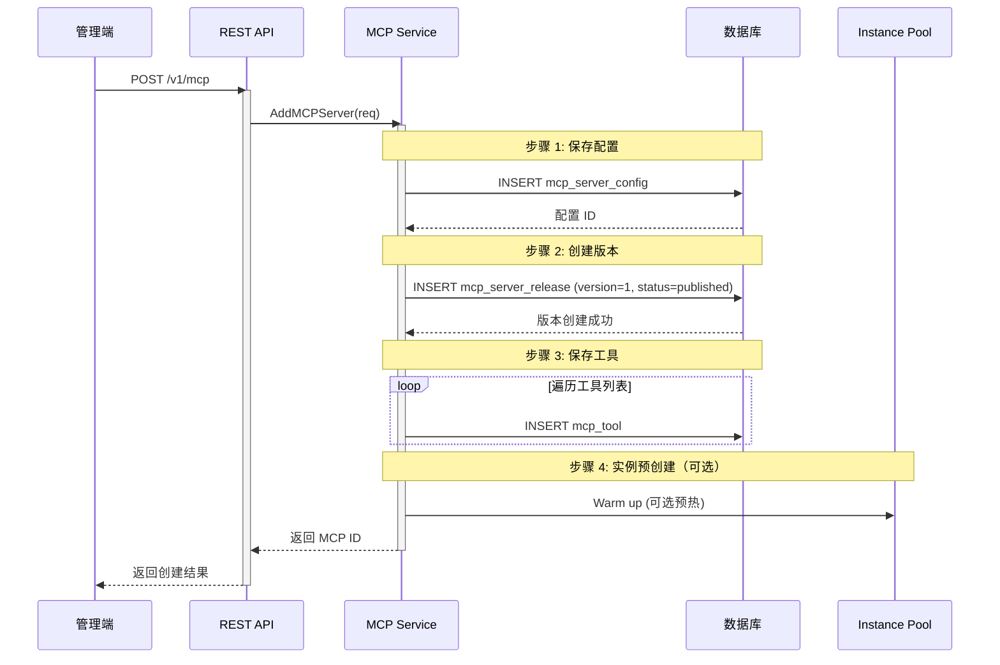

**关键改进：**
- 无需调用外部服务
- 配置保存和实例创建解耦
- 支持实例懒加载

### 6.2 MCP 工具调用流程（Stream 模式）

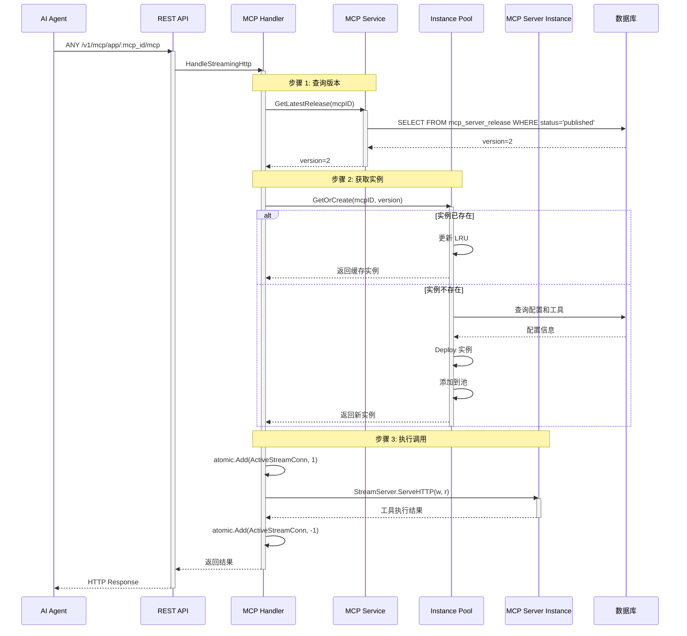

**性能优势：**
- 实例缓存，避免重复创建
- 自动版本解析，简化调用
- 活跃连接保护，避免实例被误淘汰

### 6.3 MCP Server 更新流程

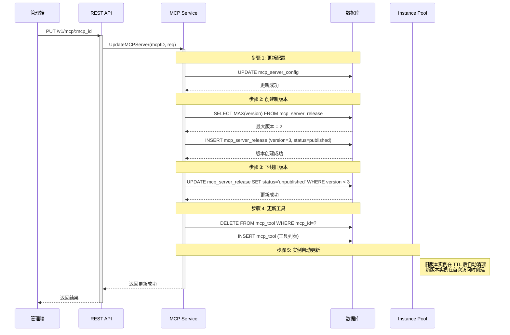

**懒更新策略：**
- 配置和版本立即更新
- 旧实例逐步过期清理
- 新实例按需创建

### 6.4 实例池清理流程

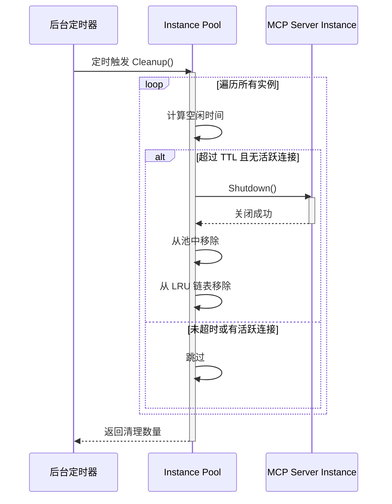

**清理策略：**
- 每 5 分钟执行一次
- 清理空闲超过 TTL 的实例
- 保护有活跃连接的实例

## 7. API 接口

### 7.1 公开 API 列表

| 路径 | 方法 | 功能 | 变化 |
|------|------|------|------|
| `/v1/mcp` | POST | 添加 MCP Server | 无变化 |
| `/v1/mcp/{mcp_id}` | GET | 查询详情 | 无变化 |
| `/v1/mcp/{mcp_id}` | PUT | 更新配置 | 无变化 |
| `/v1/mcp/{mcp_id}` | DELETE | 删除 | 无变化 |
| `/v1/mcp/list` | GET | 查询列表 | 无变化 |
| `/v1/mcp/{mcp_id}/status` | POST | 更新状态 | 无变化 |
| `/v1/mcp/proxy/{mcp_id}/tools` | GET | 获取工具列表 | 无变化 |
| `/v1/mcp/proxy/{mcp_id}/tool/call` | POST | 调用工具 | 无变化 |
| `/v1/mcp/parse/sse` | POST | 解析 SSE MCP | 无变化 |
| `/v1/mcp/market/list` | GET | 市场列表 | 无变化 |
| **`/v1/mcp/app/:mcp_id/mcp`** | **ANY** | **Stream 端点** | **新增** |
| **`/v1/mcp/app/:mcp_id/sse`** | **GET** | **SSE 端点** | **新增** |
| **`/v1/mcp/app/:mcp_id/message`** | **POST** | **Message 端点** | **新增** |

### 7.2 内部 API 列表

| 路径 | 方法 | 功能 | 变化 |
|------|------|------|------|
| `/internal-v1/mcp/proxy/{mcp_id}/tools` | GET | 获取工具列表 | 保留 |
| `/internal-v1/mcp/proxy/{mcp_id}/tool/call` | POST | 调用工具 | 保留 |
| `/internal-v1/mcp/intcomp/register` | POST | 注册内置 MCP | 保留 |
| `/internal-v1/mcp/intcomp/unregister/:mcp_id` | POST | 注销内置 MCP | 保留 |
| ~~`/internal-v1/mcp/instance/*`~~ | ~~*~~ | ~~实例管理~~ | **废弃** |
| ~~`/internal-v1/mcp/app/*`~~ | ~~*~~ | ~~MCP 端点~~ | **废弃** |

**说明：**
- 原 operator-app 的实例管理接口已废弃（内部方法调用）
- 原 operator-app 的 MCP 端点迁移到公开 API

### 7.3 URL 路径对比

| 功能 | 迁移前 (operator-app) | 迁移后 (operator-integration) |
|------|----------------------|------------------------------|
| Stream 端点 | `/internal-v1/mcp/app/:mcp_id/:version/stream` | `/v1/mcp/app/:mcp_id/mcp` |
| SSE 端点 | `/internal-v1/mcp/app/:mcp_id/:version/sse` | `/v1/mcp/app/:mcp_id/sse` |
| Message 端点 | `/internal-v1/mcp/app/:mcp_id/:version/message` | `/v1/mcp/app/:mcp_id/message` |

**关键变化：**
- 从 internal API 变为 public API
- URL 中不再包含 version 参数（自动使用最新版本）
- Stream 路径从 `/stream` 改为 `/mcp`（符合 MCP 协议规范）

## 8. 系统启动流程

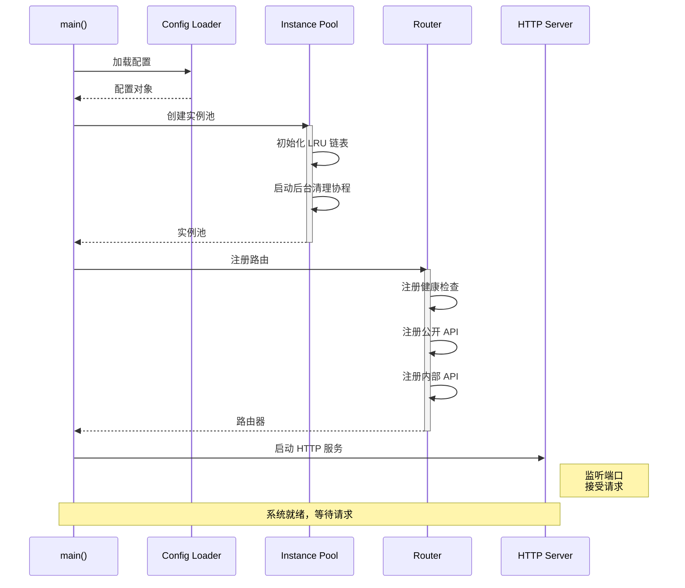

**启动特点：**
- 无需预加载所有实例
- 轻量级启动，快速就绪
- 实例按需创建

## 9. 监控与可观测性

### 9.1 关键指标

| 指标名称 | 类型 | 说明 |
|---------|------|------|
| `mcp_pool_size` | Gauge | 当前实例池大小 |
| `mcp_pool_max_size` | Gauge | 实例池最大容量 |
| `mcp_pool_hit_rate` | Gauge | 缓存命中率 |
| `mcp_pool_eviction_total` | Counter | 累计淘汰次数 |
| `mcp_pool_cleanup_total` | Counter | 累计清理次数 |
| `mcp_instance_create_total` | Counter | 实例创建总数 |
| `mcp_instance_create_duration` | Histogram | 实例创建耗时 |
| `mcp_active_connections` | Gauge | 活跃连接数 |
| `mcp_tool_call_total` | Counter | 工具调用总数 |
| `mcp_tool_call_duration` | Histogram | 工具调用耗时 |

### 9.2 日志规范

```go
// 实例创建日志
logger.Info("create mcp instance",
    "mcp_id", mcpID,
    "version", version,
    "mode", mode,
    "duration_ms", duration.Milliseconds())

// 实例淘汰日志
logger.Info("evict mcp instance",
    "mcp_id", mcpID,
    "version", version,
    "idle_duration_s", idleDuration.Seconds(),
    "reason", "lru")

// 工具调用日志
logger.Info("call mcp tool",
    "mcp_id", mcpID,
    "tool_name", toolName,
    "status", "success",
    "duration_ms", duration.Milliseconds())
```

### 9.3 调用链追踪

使用 OpenTelemetry 实现分布式追踪：

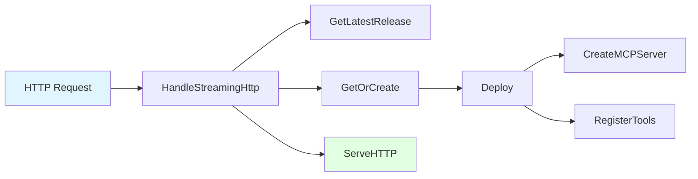

## 10. 性能优化

### 10.1 优化点对比

| 优化项 | 迁移前 | 迁移后 | 提升 |
|--------|--------|--------|------|
| **服务间调用** | HTTP 跨服务 | 本地方法调用 | **延迟降低 ~10ms** |
| **实例管理** | 全局单例，永久保留 | 实例池，LRU + TTL | **内存可控** |
| **实例创建** | 启动时全部加载 | 懒加载 | **启动速度↑** |
| **版本解析** | URL 显式指定 | 自动查询最新版本 | **API 简化** |
| **并发处理** | 全局锁 | 读写锁 + 细粒度锁 | **并发性能↑** |

### 10.2 预期性能提升

| 场景 | 迁移前 | 迁移后 | 提升 |
|------|--------|--------|------|
| 工具调用 P50 | 50ms | **40ms** | **20%** |
| 工具调用 P99 | 200ms | **150ms** | **25%** |
| 实例创建 | 5s | **5s** | 无变化 |
| 系统启动 | 20s（加载所有实例） | **2s** | **90%** |
| 内存占用 | 不可控（持续增长） | **可控（配置上限）** | - |

## 11. 容错与高可用

### 11.1 故障场景与处理

| 故障场景 | 影响 | 处理策略 |
|---------|------|----------|
| 实例创建失败 | 该实例不可用 | 返回错误，客户端重试 |
| 实例池满 | 新实例无法创建 | LRU 淘汰，为新实例腾出空间 |
| 数据库连接失败 | 配置查询失败 | 返回错误，降级处理 |
| MCP Server 崩溃 | 工具调用失败 | 自动重建实例 |

### 11.2 熔断与降级

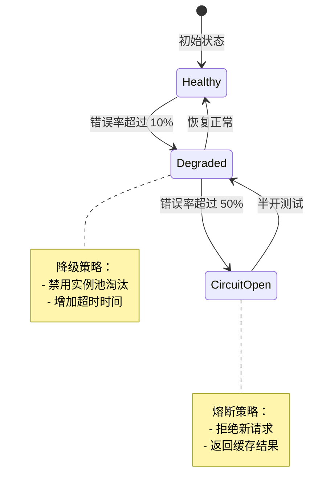

## 12. 总结

### 12.1 架构改进

1. **单服务架构**：合并两个服务为一个，简化部署和运维
2. **实例池管理**：引入 LRU + TTL 机制，优化内存使用
3. **懒加载策略**：实例按需创建，提升启动速度
4. **自动版本解析**：API 更简洁，易于使用
5. **性能提升**：消除服务间调用开销，降低延迟

### 12.2 功能完整性

迁移后保留了所有 MCP 相关功能：
- ✅ MCP Server 配置管理（CRUD）
- ✅ MCP Server 版本管理
- ✅ MCP 工具管理
- ✅ MCP 实例运行时管理
- ✅ MCP 协议端点服务（Stream、SSE、Message）
- ✅ 工具调用和执行
- ✅ 市场列表查询

### 12.3 技术亮点

1. **实例池设计**：支持 LRU 淘汰、TTL 过期、活跃保护
2. **懒加载机制**：减少资源占用，提升系统响应
3. **并发优化**：读写锁、原子操作，提升并发性能
4. **自动化管理**：版本自动解析、实例自动清理
5. **可观测性**：完善的监控指标、日志、调用链

### 12.4 运维优势

| 优势 | 说明 |
|------|------|
| **部署简化** | 只需部署一个服务 |
| **配置统一** | 所有配置在一个地方管理 |
| **监控集中** | 单一服务的监控更简单 |
| **故障排查** | 减少跨服务问题，易于定位 |
| **资源节约** | 减少服务实例数量 |

迁移后的架构更加简洁、高效、易维护，为未来的功能扩展和性能优化打下了坚实的基础。
