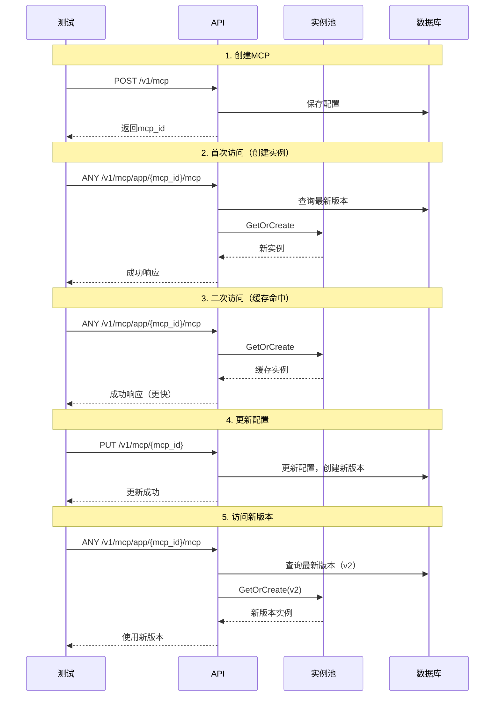
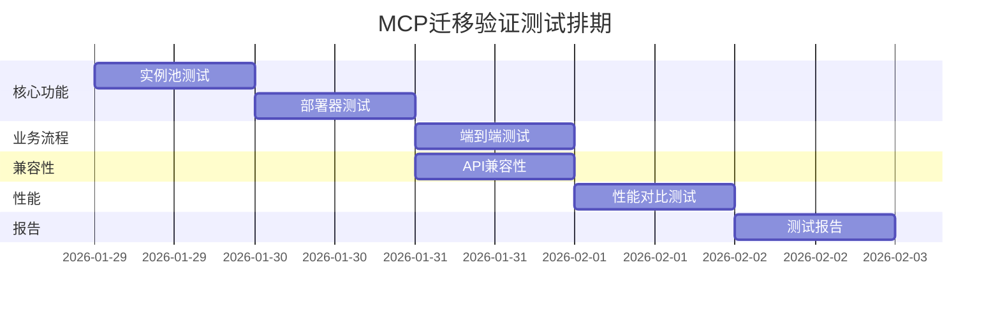

# MCP 功能迁移测试验证方案

## 1. 概述

本测试方案专注于验证 MCP 功能从 operator-app 迁移到 operator-integration 后的正确性，确保：
- ✅ 迁移的核心组件（实例池、部署器）工作正常
- ✅ API 接口完全兼容，客户端无需修改
- ✅ 性能达到或优于迁移前水平
- ✅ 核心业务流程正确

## 2. 测试范围

### 2.1 迁移核心功能测试

重点验证本次迁移新增或改动的组件：

| 组件 | 测试重点 | 优先级 |
|------|---------|--------|
| **实例池** | 创建、获取、LRU淘汰、TTL清理、并发安全 | P0 |
| **部署器** | HTTP/SSE部署、工具注册 | P0 |
| **版本自动解析** | 自动获取最新发布版本 | P0 |
| **MCP端点** | Stream/SSE/Message端点正常工作 | P0 |

### 2.2 迁移验证测试

验证迁移前后的一致性：

| 验证项 | 验证方法 | 优先级 |
|--------|---------|--------|
| **API兼容性** | 对比迁移前后API响应 | P0 |
| **功能完整性** | 核心业务流程走通 | P0 |
| **性能对比** | 对比迁移前后性能指标 | P1 |

## 3. 核心测试场景

### 3.1 实例池功能测试

#### 场景 1：实例懒加载和缓存

```go
// 验证实例懒加载和缓存命中
func TestInstancePool_LazyLoadAndCache(t *testing.T) {
    pool := NewInstancePool(10, 30*time.Minute)
    ctx := context.Background()

    // 首次访问 - 应该创建新实例
    start := time.Now()
    inst1, err := pool.GetOrCreate(ctx, "mcp-1", 1, mockConfig)
    createDuration := time.Since(start)
    assert.NoError(t, err)
    assert.NotNil(t, inst1)

    // 二次访问 - 应该返回缓存实例（更快）
    start = time.Now()
    inst2, err := pool.GetOrCreate(ctx, "mcp-1", 1, mockConfig)
    cacheDuration := time.Since(start)
    assert.NoError(t, err)
    assert.Same(t, inst1, inst2)  // 同一个实例
    assert.Less(t, cacheDuration, createDuration)  // 缓存更快
}
```

#### 场景 2：LRU 淘汰机制

```go
// 验证池满时LRU淘汰
func TestInstancePool_LRUEviction(t *testing.T) {
    pool := NewInstancePool(3, 30*time.Minute)  // 最多3个实例
    ctx := context.Background()

    // 创建3个实例
    pool.GetOrCreate(ctx, "mcp-1", 1, config1)
    pool.GetOrCreate(ctx, "mcp-2", 1, config2)
    pool.GetOrCreate(ctx, "mcp-3", 1, config3)

    // 访问mcp-1（使其成为最近使用）
    pool.GetOrCreate(ctx, "mcp-1", 1, config1)

    // 创建第4个实例，mcp-2应该被淘汰（最久未用）
    pool.GetOrCreate(ctx, "mcp-4", 1, config4)

    assert.True(t, pool.Exists("mcp-1", 1))   // 保留
    assert.False(t, pool.Exists("mcp-2", 1))  // 被淘汰
    assert.True(t, pool.Exists("mcp-3", 1))   // 保留
    assert.True(t, pool.Exists("mcp-4", 1))   // 新创建
}
```

#### 场景 3：活跃连接保护

```go
// 验证有活跃连接的实例不被淘汰
func TestInstancePool_ActiveProtection(t *testing.T) {
    pool := NewInstancePool(2, 30*time.Minute)
    ctx := context.Background()

    inst1, _ := pool.GetOrCreate(ctx, "mcp-1", 1, config1)
    inst2, _ := pool.GetOrCreate(ctx, "mcp-2", 1, config2)

    // inst1有活跃连接
    atomic.AddInt64(&inst1.ActiveStreamConn, 1)

    // 创建第3个实例，应该淘汰inst2（无活跃连接）
    pool.GetOrCreate(ctx, "mcp-3", 1, config3)

    assert.True(t, pool.Exists("mcp-1", 1))   // 有活跃连接，未被淘汰
    assert.False(t, pool.Exists("mcp-2", 1))  // 被淘汰
    assert.True(t, pool.Exists("mcp-3", 1))
}
```

### 3.2 端到端业务流程测试

#### 场景 4：完整业务流程（关键场景）



**测试代码：**

```go
func TestMCPMigration_EndToEnd(t *testing.T) {
    // 1. 创建MCP
    mcpID := createMCP(t, MCPConfig{
        Name: "Test MCP",
        Mode: "stream",
        Tools: []Tool{{Name: "echo"}},
    })

    // 2. 首次访问 - 实例创建
    resp1 := callMCPEndpoint(t, mcpID)
    assert.Equal(t, 200, resp1.StatusCode)
    duration1 := resp1.Duration

    // 3. 二次访问 - 缓存命中
    resp2 := callMCPEndpoint(t, mcpID)
    assert.Equal(t, 200, resp2.StatusCode)
    assert.Less(t, resp2.Duration, duration1) // 缓存更快

    // 4. 更新配置
    updateMCP(t, mcpID, MCPConfig{
        Name: "Updated MCP",
        Tools: []Tool{{Name: "echo"}, {Name: "add"}},
    })

    // 5. 访问新版本
    resp3 := callMCPEndpoint(t, mcpID)
    assert.Equal(t, 200, resp3.StatusCode)
    // 验证使用新版本（工具数量变化）
    tools := getTools(t, mcpID)
    assert.Len(t, tools, 2)
}
```

### 3.3 API 兼容性测试

#### 场景 5：对比迁移前后API响应

```go
// 验证迁移前后API响应格式一致
func TestMigration_APICompatibility(t *testing.T) {
    testCases := []struct {
        name     string
        endpoint string
        method   string
    }{
        {"创建MCP", "/v1/mcp", "POST"},
        {"查询MCP", "/v1/mcp/{id}", "GET"},
        {"更新MCP", "/v1/mcp/{id}", "PUT"},
        {"获取工具", "/v1/mcp/proxy/{id}/tools", "GET"},
        {"调用工具", "/v1/mcp/proxy/{id}/tool/call", "POST"},
    }

    for _, tc := range testCases {
        t.Run(tc.name, func(t *testing.T) {
            // 对比响应结构
            oldResp := getOldAPIResponse(tc.endpoint, tc.method)
            newResp := getNewAPIResponse(tc.endpoint, tc.method)

            // 验证字段一致性
            assert.Equal(t, oldResp.Fields, newResp.Fields)
            assert.Equal(t, oldResp.StatusCode, newResp.StatusCode)
        })
    }
}
```

### 3.4 性能对比测试

#### 场景 6：迁移前后性能对比

```bash
#!/bin/bash
# 性能对比测试脚本

echo "=== 迁移前性能测试 ==="
wrk -t 10 -c 100 -d 60s --latency \
    http://old-service/internal-v1/mcp/app/test-mcp/1/stream

echo "=== 迁移后性能测试 ==="
wrk -t 10 -c 100 -d 60s --latency \
    http://new-service/v1/mcp/app/test-mcp/mcp

echo "=== 对比结果 ==="
# 对比 P50, P95, P99 延迟
# 验证：迁移后延迟 ≤ 迁移前延迟
```

**验证指标：**

| 指标 | 迁移前 | 迁移后目标 | 验证方法 |
|------|--------|-----------|---------|
| P50 延迟 | 50ms | ≤ 40ms | wrk 测试 |
| P99 延迟 | 200ms | ≤ 150ms | wrk 测试 |
| 吞吐量 | 1000 qps | ≥ 1200 qps | wrk 测试 |
| 启动时间 | ~20s | ≤ 5s | 计时启动 |

## 4. 测试数据准备

### 4.1 基础测试数据

```go
// 生成20个测试MCP（覆盖不同场景）
func PrepareTestData() {
    mcps := []MCPConfig{
        // Stream模式
        {Name: "stream-mcp-1", Mode: "stream", Tools: 5},
        {Name: "stream-mcp-2", Mode: "stream", Tools: 10},
        // SSE模式
        {Name: "sse-mcp-1", Mode: "sse", Tools: 3},
        {Name: "sse-mcp-2", Mode: "sse", Tools: 8},
        // 不同业务域
        {Name: "domain-a-mcp", BusinessDomain: "domain-a"},
        {Name: "domain-b-mcp", BusinessDomain: "domain-b"},
        // ... 共20个
    }

    for _, mcp := range mcps {
        createMCP(mcp)
    }
}
```

## 5. 测试执行计划

### 5.1 测试排期



### 5.2 测试清单

| 测试项 | 用例数 | 预计耗时 | 负责人 |
|--------|--------|---------|--------|
| 实例池功能 | 5 | 1天 | 开发 |
| 部署器功能 | 3 | 1天 | 开发 |
| 端到端流程 | 3 | 1天 | 测试 |
| API兼容性 | 10 | 1天 | 测试 |
| 性能对比 | 4 | 1天 | 性能 |
| **总计** | **25** | **5天** | - |

## 6. 验收标准

### 6.1 功能验收

- ✅ 实例池所有功能正常（创建、缓存、淘汰、清理）
- ✅ 端到端业务流程走通（创建→访问→更新→访问新版本）
- ✅ 所有API接口完全兼容（响应结构一致）

### 6.2 性能验收

- ✅ P50 延迟 ≤ 40ms（优于迁移前）
- ✅ P99 延迟 ≤ 150ms（优于迁移前）
- ✅ 系统启动时间 ≤ 5s（大幅优于迁移前）

### 6.3 质量验收

- ✅ 核心代码单元测试覆盖率 ≥ 70%
- ✅ 无 P0/P1 缺陷遗留
- ✅ 并发测试无死锁和数据竞争

## 7. 测试报告模板

```markdown
# MCP迁移测试报告

## 测试摘要
- 测试时间：2026-01-29 ~ 2026-02-02
- 测试环境：测试环境（K8s）
- 测试结论：✅ 通过 / ❌ 未通过

## 测试结果

### 核心功能测试
| 测试项 | 用例数 | 通过 | 失败 | 通过率 |
|--------|--------|------|------|--------|
| 实例池 | 5 | 5 | 0 | 100% |
| 部署器 | 3 | 3 | 0 | 100% |
| 端到端 | 3 | 3 | 0 | 100% |

### API兼容性
- ✅ 所有API响应格式一致
- ✅ 客户端无需修改

### 性能对比
| 指标 | 迁移前 | 迁移后 | 改善 |
|------|--------|--------|------|
| P50延迟 | 50ms | 38ms | ↓24% |
| P99延迟 | 200ms | 145ms | ↓27% |
| 启动时间 | 20s | 3s | ↓85% |

## 遗留问题
（如有）

## 上线建议
✅ 可以上线 / ⚠️ 需要修复问题后上线
```

## 8. 快速执行指南

### 8.1 本地快速验证

```bash
# 1. 启动服务
cd operator-integration
go run server/main.go

# 2. 运行核心测试
go test ./server/logics/mcpinstance -v -run TestInstancePool
go test ./server/tests/integration -v -run TestMCPMigration_EndToEnd

# 3. 快速性能检查
curl -X POST http://localhost:8080/v1/mcp -d @test_mcp.json
time curl http://localhost:8080/v1/mcp/app/{mcp_id}/mcp
```

### 8.2 完整测试执行

```bash
# 运行所有迁移验证测试
./scripts/run_migration_tests.sh

# 生成测试报告
./scripts/generate_test_report.sh
```

---

**说明：** 本测试方案聚焦于验证迁移的核心功能和关键场景，确保迁移质量。如需更全面的测试，可以在此基础上扩展。
